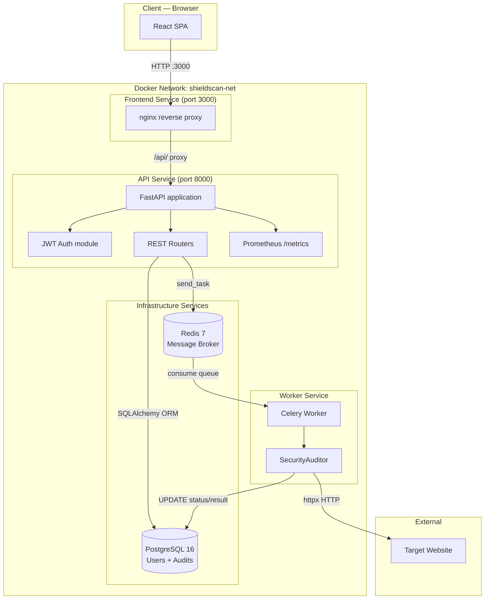
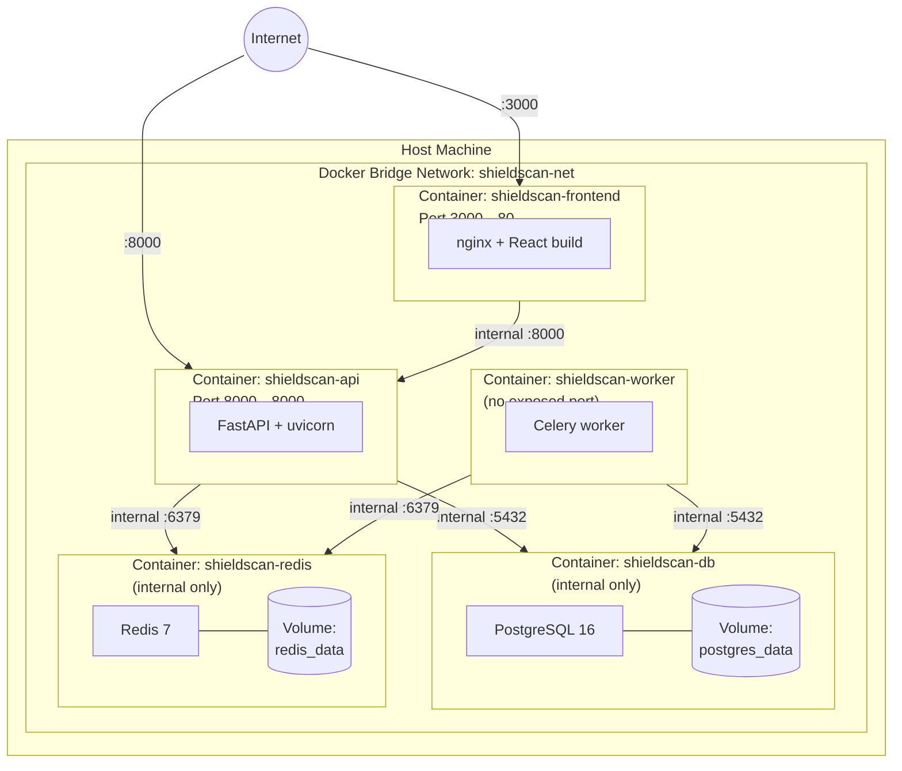
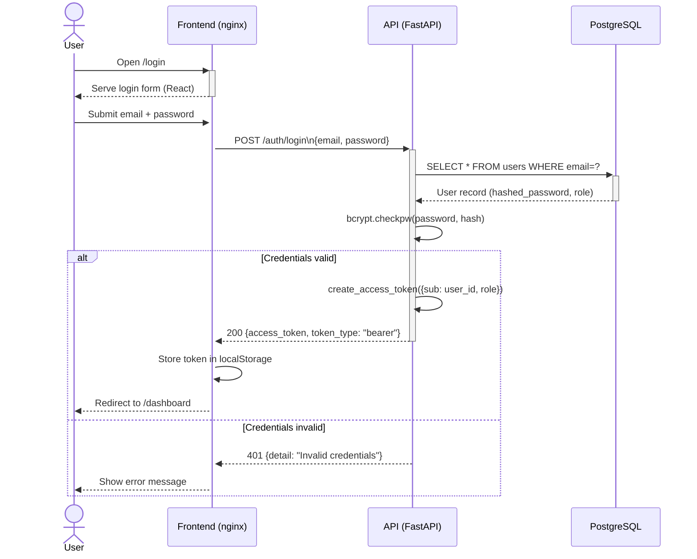
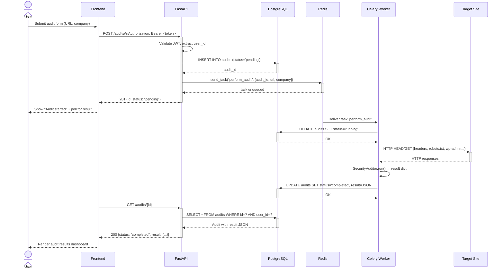
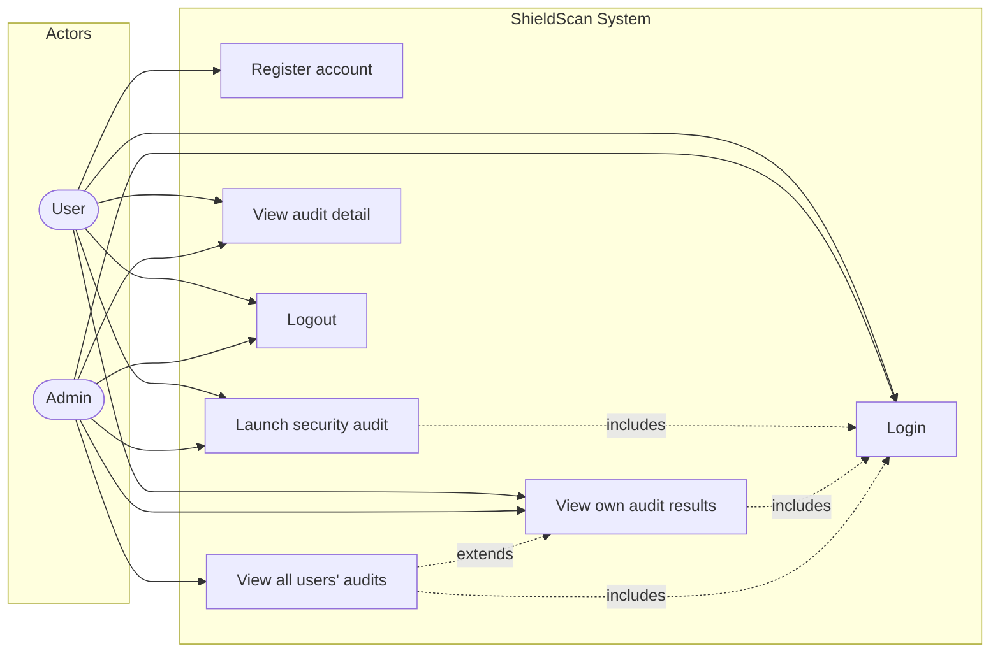
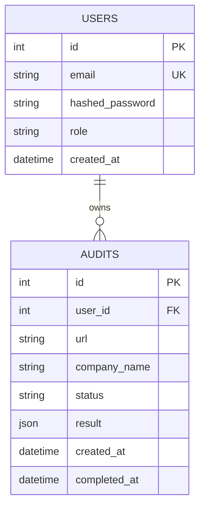
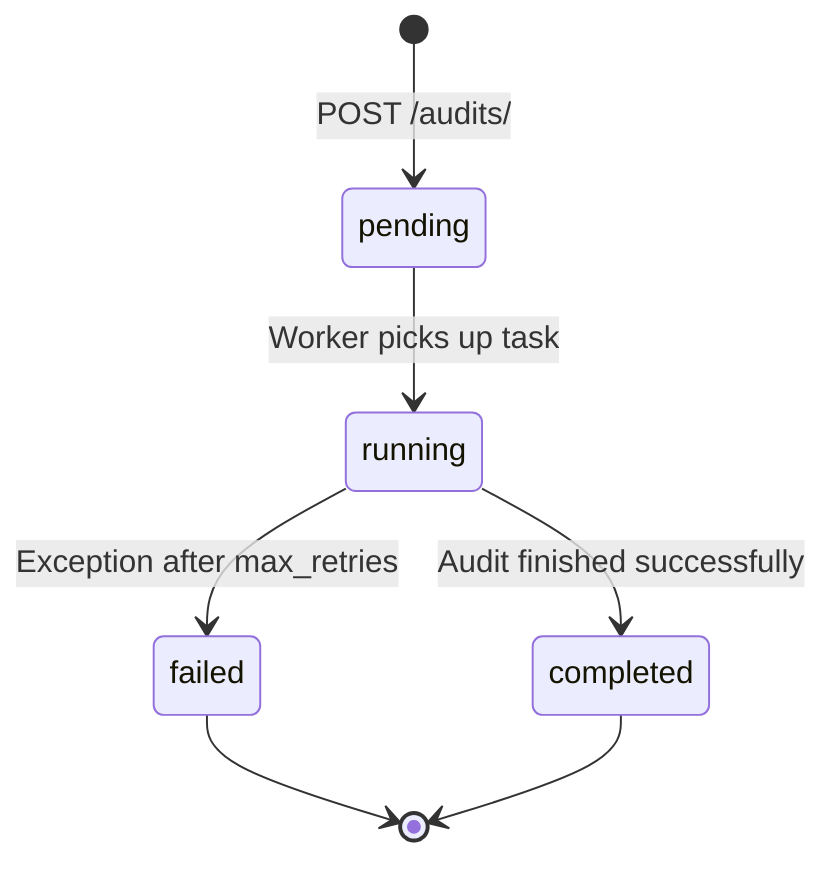

# Architecture Manual — ShieldScan v2.0

## 1. Overview

ShieldScan is a web security auditing platform designed around a **microservices architecture**. The system decouples concerns into independent, deployable services that communicate through well-defined interfaces: a synchronous REST API and an asynchronous message queue.

The core design principle is **separation of concerns**: the API handles authentication, authorization, and request dispatch; the worker handles the long-running, I/O-intensive audit process; the frontend handles user interaction. This separation enables independent scaling, independent deployment, and independent failure domains.

---

## 2. Component Diagram

### Component responsibilities

| Component | Responsibility | Technology |
|-----------|---------------|-----------|
| **nginx** | Serve static React build; proxy `/api/*` to FastAPI | nginx:alpine |
| **FastAPI** | REST API, JWT authentication, role enforcement, Celery dispatch | Python 3.11, FastAPI 0.104 |
| **Celery Worker** | Consume audit tasks from Redis, execute security checks, write results to DB | Celery 5.3, httpx |
| **PostgreSQL** | Persistent storage of users and audit results | PostgreSQL 16 |
| **Redis** | Async message broker between API and worker | Redis 7 |

---

## 3. Deployment Diagram

### Design decisions

- **PostgreSQL and Redis are not exposed to the host** — only accessible inside the Docker bridge network. This eliminates direct external attack surface.
- **Frontend uses nginx as both static file server and API proxy** — avoids CORS preflight requests from the browser and centralizes the entry point.
- **Worker has no exposed port** — it only consumes from the Redis queue. There is no inbound network path to the worker.
- **Volumes are named Docker volumes**, not bind mounts — ensures data persists across container restarts and avoids filesystem permission issues.

---

## 4. Sequence Diagram — Authentication Flow

### Sequence Diagram — Audit Execution Flow

---

## 5. Use Case Diagram

### Actor definitions

| Actor | Description |
|-------|-------------|
| **User** | Authenticated user with standard access; can only see their own audits |
| **Admin** | Elevated role; can view all audits from all users via `/audits/admin/all` |

---

## 6. Data Model

### Audit status lifecycle

---

## 7. Design Patterns

| Pattern | Where applied | Justification |
|---------|--------------|---------------|
| **API Gateway** | FastAPI is the single entry point for all client requests | Centralizes auth, rate limiting, and routing |
| **Message Queue** | Redis + Celery decouples audit execution from the HTTP request | HTTP requests return in < 200ms; audits take 5–30s |
| **Repository pattern** | SQLAlchemy Session + ORM models | Decouples business logic from SQL; enables unit testing without a real DB |
| **Role-based access control** | `require_admin` dependency in FastAPI | Enforces authorization at the framework level, not business logic |
| **Non-root containers** | All Dockerfiles switch to a non-root user | Defense-in-depth: limits blast radius if a container is compromised |
| **Health checks** | All Docker services define `HEALTHCHECK` | Enables Docker Compose `depends_on: condition: service_healthy`, prevents race conditions on startup |

---

## 8. Technology Justification

| Choice | Alternatives considered | Why chosen |
|--------|------------------------|------------|
| **FastAPI** over Flask | Flask, Django | Automatic OpenAPI docs, native async support, Pydantic validation |
| **Celery + Redis** over threading | Python threads, asyncio | Persistent task queue, retry logic, horizontal worker scaling |
| **PostgreSQL** over SQLite | SQLite, MySQL | Production-grade, ACID compliant, JSON column support |
| **bcrypt direct** over passlib | passlib | passlib 1.7.4 is unmaintained and incompatible with bcrypt ≥ 4.0.0 |
| **JWT** over session cookies | Session cookies | Stateless — works across microservices; no server-side session storage |
| **nginx** as frontend server | Node.js serve, Apache | Minimal footprint, built-in reverse proxy, production-battle-tested |
