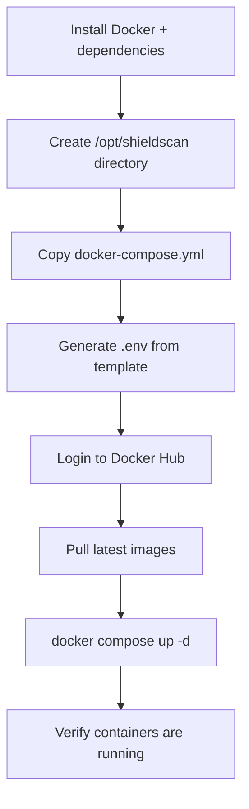

# Deployment and Operations Guide — ShieldScan v2.0

## 1. Deployment Options

| Option | Use case | Complexity |
|--------|----------|-----------|
| **Docker Compose** | Local development, single-server staging | Low |
| **Docker Swarm** | Single-server production with orchestration | Medium |
| **Ansible automated** | Reproducible deployment to a clean server | Medium |

---

## 2. Prerequisites

### Target server requirements

- Ubuntu 22.04 LTS (or any Linux with Docker support)
- Minimum 2 CPU cores, 4 GB RAM
- Open ports: `22` (SSH), `80` (HTTP), `443` (HTTPS), `3000` (frontend), `8000` (API)
- Docker Engine 24+ and Docker Compose plugin installed

### Required credentials and secrets

| Secret | Description | Where used |
|--------|-------------|-----------|
| `DB_PASSWORD` | PostgreSQL password | docker-compose, Swarm secrets |
| `SECRET_KEY` | JWT signing key (≥ 32 random chars) | docker-compose, Swarm secrets |
| `DOCKER_HUB_USER` | `migueldevsec` | GitHub Actions, Ansible |
| `DOCKER_HUB_PASSWORD` | Docker Hub access token | GitHub Actions, Ansible |

Generate a strong `SECRET_KEY`:
```bash
python3 -c "import secrets; print(secrets.token_hex(32))"
```

---

## 3. Option A — Docker Compose (Development / Staging)

### 3.1 Clone and configure

```bash
git clone https://github.com/miguel-devsec/ShieldScan.git
cd ShieldScan
cp env.example .env
nano .env          # Set DB_PASSWORD and SECRET_KEY
```

### 3.2 Start all services

```bash
docker compose up -d --build
```

### 3.3 Verify deployment

```bash
# Check all containers are running and healthy
docker compose ps

# Expected output — all Status should show "healthy" or "running"
# shieldscan-db         running (healthy)
# shieldscan-redis      running (healthy)
# shieldscan-api        running
# shieldscan-worker     running
# shieldscan-frontend   running

# Test the API health endpoint
curl http://localhost:8000/health
# Expected: {"status":"ok","service":"shieldscan-api"}
```

### 3.4 Create admin user

```bash
# Register via UI first, then promote:
docker exec -it shieldscan-db psql -U shieldscan -d shieldscan \
  -c "UPDATE users SET role='admin' WHERE email='admin@example.com';"
```

---

## 4. Option B — Docker Swarm (Production)

Docker Swarm provides service orchestration, rolling updates, and secret management without external dependencies.

### 4.1 Initialize the swarm

```bash
docker swarm init
```

### 4.2 Create secrets

```bash
echo "your_strong_db_password" | docker secret create db_password -
echo "your_jwt_secret_key_32_chars"  | docker secret create secret_key -
```

Secrets are stored encrypted in the Swarm Raft log and injected into containers at `/run/secrets/<name>`.

### 4.3 Deploy the stack

```bash
docker stack deploy -c orquestacion/docker-swarm.yml shieldscan
```

### 4.4 Verify the stack

```bash
docker stack services shieldscan
# All services should show REPLICAS = 1/1 (or N/N for scaled services)

docker stack ps shieldscan
# Shows individual task status per node
```

### 4.5 Scale a service

```bash
docker service scale shieldscan_worker=3    # Run 3 worker replicas
docker service scale shieldscan_api=2       # Run 2 API replicas
```

### 4.6 Rolling update

```bash
docker service update \
  --image migueldevsec/shieldscan-api:v20250504-1200 \
  shieldscan_api
```

### 4.7 Remove the stack

```bash
docker stack rm shieldscan
docker secret rm db_password secret_key    # Only if fully decommissioning
```

---

## 5. Option C — Automated Deployment with Ansible

Ansible automates the full server provisioning from a clean Ubuntu machine: installs Docker, copies configuration, pulls images, and starts services.

### 5.1 Configure the inventory

Edit `infraestructura/ansible/inventory.yml`:

```yaml
all:
  hosts:
    production:
      ansible_host: YOUR_SERVER_IP
      ansible_user: ubuntu
      ansible_ssh_private_key_file: ~/.ssh/your_key.pem
```

### 5.2 Run the playbook

```bash
ansible-playbook \
  -i infraestructura/ansible/inventory.yml \
  infraestructura/ansible/playbook.yml \
  -e "db_password=YOUR_DB_PASS secret_key=YOUR_JWT_KEY \
      docker_hub_user=migueldevsec docker_hub_password=YOUR_TOKEN"
```

The playbook performs these steps automatically:



### 5.3 Idempotency

The playbook is fully idempotent — running it again on an already-configured server updates the configuration without side effects.

---

## 6. Environment Variables Reference

| Variable | Required | Default | Description |
|----------|----------|---------|-------------|
| `DB_PASSWORD` | Yes | `shieldscan` | PostgreSQL password |
| `SECRET_KEY` | Yes | `changeme-...` | JWT signing key — change in production |
| `DATABASE_URL` | No | auto-built | Full PostgreSQL connection URL |
| `REDIS_URL` | No | `redis://redis:6379/0` | Redis connection URL |
| `GRAFANA_PASSWORD` | No | `admin` | Grafana dashboard password |

**Never commit `.env` to the repository.** The `.gitignore` excludes it, but verify with `git status` before every commit.

---

## 7. Monitoring Stack (Phase 6)

The monitoring stack is optional and uses Docker Compose profiles. It does not affect the main application services.

### 7.1 Start with monitoring

```bash
docker compose --profile monitoring up -d
```

| Service | URL | Purpose |
|---------|-----|---------|
| Prometheus | http://localhost:9090 | Metrics database, query interface |
| Grafana | http://localhost:3001 | Dashboards (admin/admin) |
| Loki | http://localhost:3100 | Log aggregation backend |

### 7.2 Recommended Grafana dashboards

In Grafana, navigate to **Dashboards → Import** and use these IDs:

| Dashboard ID | Name | Data source |
|-------------|------|------------|
| 17175 | FastAPI Observability | Prometheus |
| 15141 | Docker Container Logs | Loki |

### 7.3 Falco alerts

```bash
docker logs -f shieldscan-falco    # Watch runtime anomaly alerts in real time
```

---

## 8. Verifying a Successful Deployment

Run this checklist after any deployment:

```bash
# 1. All containers healthy
docker compose ps

# 2. API responds
curl -s http://localhost:8000/health | python3 -m json.tool

# 3. Frontend serves HTML
curl -s http://localhost:3000 | grep -c "ShieldScan"

# 4. Database reachable
docker exec shieldscan-db pg_isready -U shieldscan

# 5. Redis reachable
docker exec shieldscan-redis redis-cli ping    # Expected: PONG

# 6. Worker connected to broker
docker logs shieldscan-worker | grep -i "ready"
```

---

## 9. Troubleshooting

### Container exits immediately on startup

```bash
docker compose logs <service-name>
```

Common causes:
- `api` or `worker`: database not ready yet — check `db` health check status
- `frontend`: nginx config error — check nginx.conf syntax

### API returns 500 on login/register

```bash
docker compose logs api | tail -20
```

Likely cause: database migration not applied. The API creates tables on startup via `Base.metadata.create_all()`. If the DB volume is corrupted:
```bash
docker compose down -v    # WARNING: deletes all data
docker compose up -d
```

### Worker not processing audits

```bash
docker compose logs worker | grep -E "(ERROR|WARN|Connected)"
```

Verify Redis is reachable from the worker:
```bash
docker exec shieldscan-worker redis-cli -h redis ping
```

### Port already in use

```bash
# Find what is using the port
netstat -tlnp | grep 3000
# Kill it or change the port mapping in docker-compose.yml
```

### Grafana shows "No data"

1. Verify Prometheus is scraping: http://localhost:9090/targets — API target should show `UP`
2. Verify the datasource in Grafana → Configuration → Data Sources
3. Check Loki connection: Grafana → Explore → select Loki → run `{job="docker"}`

---

## 10. Backup and Recovery

### Backup PostgreSQL data

```bash
docker exec shieldscan-db pg_dump -U shieldscan shieldscan \
  > backup_$(date +%Y%m%d).sql
```

### Restore from backup

```bash
docker exec -i shieldscan-db psql -U shieldscan shieldscan \
  < backup_20250504.sql
```

### Backup Docker volumes

```bash
docker run --rm \
  -v shieldscan_postgres_data:/data \
  -v $(pwd):/backup \
  alpine tar czf /backup/postgres_volume.tar.gz /data
```

---

## 11. CI/CD Automatic Deployment

The GitHub Actions pipeline automatically builds and pushes images to Docker Hub on every push to `main`. Images are tagged with both `vYYYYMMDD-HHMM` and `latest`.

To deploy the latest published images on your server:

```bash
docker compose pull          # Pull latest images from Docker Hub
docker compose up -d         # Restart services with new images
```

Or with Ansible (fully automated):
```bash
ansible-playbook -i infraestructura/ansible/inventory.yml \
  infraestructura/ansible/playbook.yml -e "..."
```
