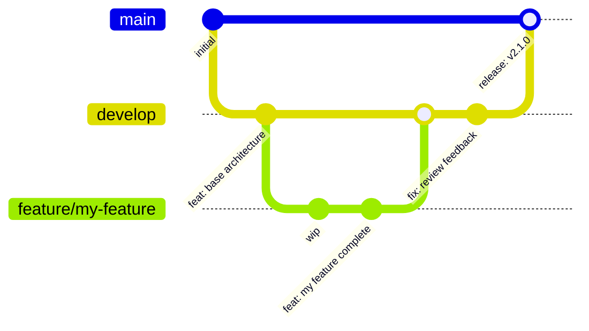

# Development Guide — ShieldScan v2.0

## 1. Prerequisites

| Tool | Minimum version | Purpose |
|------|----------------|---------|
| Docker Desktop | 4.x | Run all services locally |
| Docker Compose | v2 (`docker compose`) | Orchestrate local environment |
| Git | 2.x | Version control |
| Python | 3.11 | Run tests and pre-commit hooks locally |
| Node.js | 18+ | Frontend development (optional) |

---

## 2. Initial Setup

### 2.1 Clone the repository

```bash
git clone https://github.com/miguel-devsec/ShieldScan.git
cd ShieldScan
```

### 2.2 Configure environment variables

```bash
cp env.example .env
```

Edit `.env` and set at minimum:

```env
DB_PASSWORD=a_secure_local_password
SECRET_KEY=a_random_string_at_least_32_characters
```

For local development the defaults work, but never use them in production.

### 2.3 Install pre-commit hooks

Pre-commit hooks run security checks automatically before every `git commit`. Install them once:

```bash
pip install pre-commit
pre-commit install
```

After this, every `git commit` will automatically run Gitleaks (secret detection), Bandit (Python SAST), and hygiene checks. If any hook fails, the commit is blocked until you fix the issue.

To run the hooks manually on all files at any time:

```bash
pre-commit run --all-files
```

---

## 3. Running Services in Development Mode

### 3.1 Start all services

```bash
docker compose up --build
```

This builds images from source and starts all 5 services. Wait for all health checks to pass (approximately 30 seconds on first run).

| Service | URL | Notes |
|---------|-----|-------|
| Frontend | http://localhost:3000 | React SPA via nginx |
| API + Swagger | http://localhost:8000/docs | Interactive API documentation |
| API Health | http://localhost:8000/health | Returns `{"status":"ok"}` |
| API Metrics | http://localhost:8000/metrics | Prometheus scrape endpoint |

### 3.2 Start only backend services (for frontend dev)

```bash
docker compose up db redis api worker
```

Then run the frontend locally:

```bash
cd servicios/frontend
npm install
npm run dev      # Starts Vite dev server on port 5173
```

### 3.3 Rebuild a single service after code changes

```bash
docker compose up --build api        # Rebuild only the API
docker compose restart worker        # Restart worker (if code unchanged)
```

### 3.4 View logs

```bash
docker compose logs -f api           # Follow API logs
docker compose logs -f worker        # Follow worker logs
docker compose logs -f               # Follow all services
```

### 3.5 Stop all services

```bash
docker compose down                  # Stop and remove containers
docker compose down -v               # Also remove volumes (resets DB)
```

---

## 4. Project Structure

```
servicios/
├── api/
│   ├── app/
│   │   ├── main.py          # FastAPI app, middleware, router registration
│   │   ├── database.py      # SQLAlchemy engine and session factory
│   │   ├── models.py        # ORM models: User, Audit
│   │   ├── schemas.py       # Pydantic request/response schemas
│   │   ├── auth.py          # JWT creation/validation, password hashing
│   │   └── routers/
│   │       ├── auth.py      # /auth/register, /auth/login, /auth/me
│   │       └── audits.py    # /audits/ CRUD + admin endpoint
│   ├── tests/
│   │   └── test_api.py      # Pytest unit tests
│   ├── requirements.txt
│   └── Dockerfile
│
├── worker/
│   ├── app/
│   │   ├── worker.py        # Celery application instance + config
│   │   ├── tasks.py         # perform_audit Celery task
│   │   ├── auditor.py       # SecurityAuditor class (all security checks)
│   │   └── database.py      # SQLAlchemy session for the worker
│   ├── requirements.txt
│   └── Dockerfile
│
└── frontend/
    ├── src/
    │   ├── App.jsx           # React Router setup
    │   ├── pages/            # Login, Register, Dashboard, AuditDetail
    │   └── components/       # Shared UI components
    ├── public/
    ├── nginx.conf            # nginx configuration with API proxy
    ├── package.json
    └── Dockerfile
```

---

## 5. Running Tests

### 5.1 Unit tests (Pytest)

```bash
cd servicios/api
pip install -r requirements.txt pytest pytest-cov httpx
pytest tests/ -v --tb=short --cov=app --cov-report=term-missing
```

The test suite uses `TestClient` from FastAPI's test utilities with an in-memory SQLite database — no running Docker services required.

### 5.2 Run tests inside Docker (same as CI)

```bash
docker compose run --rm api pytest tests/ -v
```

### 5.3 Check test coverage

After running with `--cov`, a summary is printed to the terminal. For an HTML report:

```bash
pytest tests/ --cov=app --cov-report=html
open htmlcov/index.html
```

### 5.4 Manual API testing

With the services running, use the Swagger UI at http://localhost:8000/docs:

1. `POST /auth/register` — create a test user
2. `POST /auth/login` — obtain a JWT token
3. Click **Authorize** and paste the token
4. `POST /audits/` — submit a URL for auditing
5. `GET /audits/{id}` — poll until status is `completed`

---

## 6. Security Checks Locally

### Pre-commit hooks (runs automatically on commit)

```bash
pre-commit run --all-files        # Run all hooks manually
pre-commit run gitleaks           # Run only Gitleaks
pre-commit run bandit             # Run only Bandit
```

### Trivy (dependency scan)

```bash
trivy fs servicios/api --severity HIGH,CRITICAL
trivy fs servicios/worker --severity HIGH,CRITICAL
```

### Bandit (Python SAST)

```bash
bandit -r servicios/api/app servicios/worker/app --severity-level medium
```

---

## 7. Contributing — Branching Strategy



| Branch | Purpose | Rules |
|--------|---------|-------|
| `main` | Production-ready code | Protected; requires PR + passing pipeline |
| `develop` | Integration branch | Requires PR from feature branches |
| `feature/*` | New features | Branch from `develop`; merge back to `develop` |
| `fix/*` | Bug fixes | Branch from `develop` or `main` for hotfixes |

### Branch workflow

```bash
git checkout develop
git pull origin develop
git checkout -b feature/my-feature

# ... make changes ...

git add servicios/api/app/new_file.py
git commit -m "feat: add new security check for X"
git push origin feature/my-feature
# Then open a Pull Request on GitHub → develop
```

---

## 8. Commit Conventions

Follow the [Conventional Commits](https://www.conventionalcommits.org/) specification:

```
<type>: <short description>

[optional body]
```

| Type | When to use |
|------|------------|
| `feat` | New feature |
| `fix` | Bug fix |
| `docs` | Documentation only |
| `refactor` | Code change that neither fixes a bug nor adds a feature |
| `test` | Adding or correcting tests |
| `chore` | Build process, dependencies, CI configuration |
| `security` | Security-related change (preferred over `fix` for CVE remediation) |

**Examples:**

```bash
git commit -m "feat: add SSL certificate expiry check to auditor"
git commit -m "fix: handle timeout when target site is unreachable"
git commit -m "security: remove passlib, use bcrypt directly (CVE mitigation)"
git commit -m "docs: add sequence diagram for auth flow"
```

---

## 9. Code Review Process

1. Open a Pull Request from your branch to `develop`
2. The DevSecOps pipeline runs automatically on the PR (Gitleaks, SAST, SCA, build, tests)
3. All pipeline jobs must pass before merge is allowed
4. At least one reviewer must approve
5. Squash and merge is preferred to keep `develop` history clean

### What reviewers check

- Does the code introduce new secrets or hardcoded credentials?
- Are new API endpoints protected with proper authentication?
- Are user inputs validated with Pydantic before reaching business logic?
- Are SQL queries going through the ORM (no raw string interpolation)?
- Do new endpoints have corresponding tests?

---

## 10. Adding a New Security Check

The audit logic lives in [servicios/worker/app/auditor.py](../servicios/worker/app/auditor.py). To add a new check:

1. Add a new method `_check_my_feature(self) -> dict` to `SecurityAuditor`
2. Call it inside `run()` and merge the result into the output dict
3. Update the frontend result renderer in `src/pages/AuditDetail.jsx` to display the new field
4. Add a test in `servicios/api/tests/test_api.py` (mock the worker; test the API response shape)
