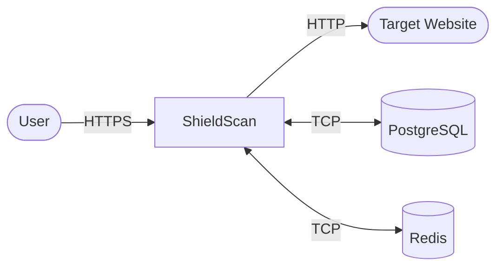
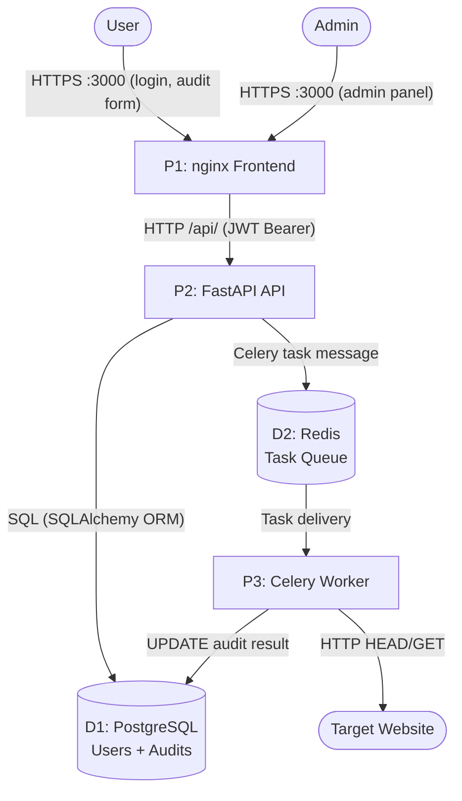
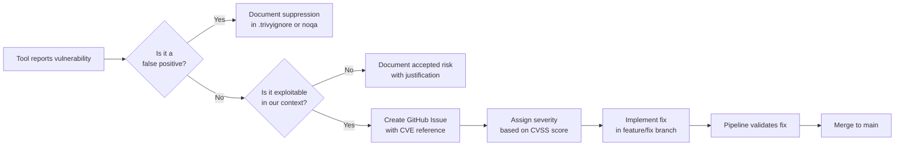

# Security Manual — ShieldScan v2.0

## 1. Threat Model

### 1.1 Methodology

ShieldScan uses the **STRIDE** threat modeling framework applied to a Data Flow Diagram (DFD). STRIDE categorizes threats by type:

| Letter | Threat | Property violated |
|--------|--------|------------------|
| **S** | Spoofing | Authentication |
| **T** | Tampering | Integrity |
| **R** | Repudiation | Non-repudiation |
| **I** | Information Disclosure | Confidentiality |
| **D** | Denial of Service | Availability |
| **E** | Elevation of Privilege | Authorization |

Tool: OWASP Threat Dragon | Full diagram: [threat-model.md](threat-model.md)

### 1.2 Data Flow Diagram — Level 0



### 1.3 Data Flow Diagram — Level 1



### 1.4 STRIDE Analysis

| Threat | Component | Description | Mitigation |
|--------|-----------|-------------|-----------|
| **S** — Spoofing | API `/auth/login` | Attacker impersonates a valid user | bcrypt password hashing; JWT with expiry; no username enumeration in error messages |
| **S** — Spoofing | JWT validation | Attacker forges a JWT token | Tokens signed with `HS256` + strong `SECRET_KEY`; expiry enforced on every request |
| **T** — Tampering | Audit results (DB) | Attacker modifies stored audit results | Results written only by the worker via parameterized SQL; no user-writable audit fields |
| **T** — Tampering | Redis task queue | Attacker injects malicious tasks | Redis not exposed outside Docker network; no external access path |
| **R** — Repudiation | Audit actions | User denies launching an audit | `user_id` foreign key stored with every audit; `created_at` timestamp immutable |
| **I** — Info Disclosure | PostgreSQL | DB credentials leaked via logs or errors | DB not exposed to host; credentials via env vars only; SQLAlchemy masks connection URL in stack traces |
| **I** — Info Disclosure | JWT payload | Sensitive data in token | JWT payload contains only `user_id` and `role`; no PII or passwords |
| **I** — Info Disclosure | API error messages | Stack traces exposed to client | FastAPI exception handlers return generic messages; debug mode off in production |
| **D** — DoS | Worker | Flood of audit requests exhausts worker resources | Celery rate limiting configurable; DB connection pool limits |
| **D** — DoS | Target website | ShieldScan used as a DoS amplifier against targets | Auditor sends only HEAD/GET requests; no flooding; `timeout=10s` per request |
| **E** — Elevation | Admin endpoints | Regular user accesses `/audits/admin/all` | `require_admin` FastAPI dependency checks `role` claim in JWT on every request |
| **E** — Elevation | Container escape | Compromised container gains host access | All containers run as non-root; minimal base images; no privileged mode (except Falco) |

---

## 2. Implemented Security Controls

### 2.1 Authentication and Authorization

| Control | Implementation | File |
|---------|---------------|------|
| Password hashing | `bcrypt.hashpw()` with random salt | `servicios/api/app/auth.py` |
| JWT tokens | `python-jose`, HS256, 24h expiry | `servicios/api/app/auth.py` |
| Role enforcement | `require_admin` FastAPI dependency | `servicios/api/app/auth.py` |
| Token validation | Every protected endpoint via `get_current_user` | `servicios/api/app/auth.py` |

### 2.2 Container Security

| Control | Implementation |
|---------|---------------|
| Non-root user | All Dockerfiles: `RUN useradd -m appuser && USER appuser` |
| Minimal base images | `python:3.11-slim`, `node:18-alpine`, `nginx:alpine` |
| No secrets in images | All secrets via environment variables |
| Health checks | All services define `HEALTHCHECK` |
| Network isolation | PostgreSQL and Redis on internal Docker network only |

### 2.3 Input Validation

- All API request bodies validated with **Pydantic** schemas before reaching business logic
- URL normalization: `http://` or `https://` prefix enforced before auditing
- SQL injection prevented: all queries go through **SQLAlchemy ORM** with parameterized statements

### 2.4 CORS

FastAPI CORS middleware is configured. In production, `allow_origins=["*"]` should be replaced with the specific frontend origin.

---

## 3. Security Tools in the Pipeline

### 3.1 Gitleaks — Secret Detection

**What it does:** Scans the entire git history for secrets, API keys, passwords, and tokens that were accidentally committed.

**Where it runs:**
- GitHub Actions: `secrets-scan` job on every push
- Locally: pre-commit hook on every `git commit`

**Configuration:** Uses Gitleaks default rules (150+ regex patterns covering AWS keys, JWT secrets, Docker tokens, etc.)

**Interpreting results:**

```
Finding:     Secret
RuleID:      generic-api-key
File:        servicios/api/app/config.py
Line:        12
Commit:      abc1234
```

If Gitleaks reports a finding:
1. **Do not push** the commit
2. Revoke the exposed secret immediately (rotate keys, change passwords)
3. Remove the secret from the file — use an environment variable instead
4. Use `git filter-repo` to purge the secret from history if it was already committed
5. Force-push the cleaned history

### 3.2 Bandit — Python SAST

**What it does:** Static analysis of Python source code looking for common security vulnerabilities.

**Where it runs:**
- GitHub Actions: `sast` job — fails on HIGH severity
- Locally: pre-commit hook on every `git commit`

**Severity levels:** LOW, MEDIUM, HIGH
**Confidence levels:** LOW, MEDIUM, HIGH

The pipeline is configured to fail on `--severity-level medium --confidence-level medium`.

**Common findings and how to handle them:**

| Issue ID | Finding | Action |
|----------|---------|--------|
| B105 | Hardcoded password | Move to env var |
| B106 | Password in function call | Review and refactor |
| B301 | Pickle usage | Avoid pickle; use JSON |
| B501 | Weak SSL/TLS version | Enforce TLS 1.2+ |
| B601 | Shell injection | Use `subprocess` with list args |

**Suppressing a false positive** (only when justified):

```python
result = subprocess.run(cmd, shell=True)  # noqa: B602 — cmd is internal constant
```

Document the suppression reason in a code comment.

### 3.3 Semgrep — Advanced SAST

**What it does:** Pattern-based static analysis using rule sets `p/python`, `p/security-audit`, and `p/owasp-top-ten`.

**Where it runs:** GitHub Actions: `sast` job

**Interpreting SARIF output:** Results are uploaded to GitHub Security → Code Scanning Alerts automatically via the pipeline.

**Key rule sets applied:**
- `p/python` — Python-specific security patterns
- `p/security-audit` — General security anti-patterns
- `p/owasp-top-ten` — OWASP Top 10 vulnerability patterns

### 3.4 Trivy — SCA and Image Scanning

**Two scanning modes:**

| Mode | Job | What it scans |
|------|-----|--------------|
| `fs` (filesystem) | `sca` | `requirements.txt`, `package.json` — vulnerable dependencies |
| `image` | `build-and-scan` | Built Docker images — OS packages + language libs |

**Image scan behavior:** The pipeline **fails with exit code 1** if any `CRITICAL` severity CVE is found in a Docker image. This is a hard security gate.

**Interpreting a Trivy report:**

```
┌──────────────┬────────────────┬──────────┬──────────────────────┐
│   Library    │ Vulnerability  │ Severity │ Fixed Version        │
├──────────────┼────────────────┼──────────┼──────────────────────┤
│ openssl      │ CVE-2024-XXXX  │ CRITICAL │ 3.0.14               │
└──────────────┴────────────────┴──────────┴──────────────────────┘
```

**Remediation options:**
1. **Update the dependency**: Change the version in `requirements.txt` or upgrade the base image
2. **Document and accept** (for non-exploitable CVEs): Add to `.trivyignore` with documented justification

```
# .trivyignore — only for CVEs that are confirmed not exploitable
# CVE-2024-XXXX: only exploitable when feature X is used; we don't use feature X
CVE-2024-XXXX
```

### 3.5 OWASP ZAP — Dynamic Application Security Testing (DAST)

**What it does:** Actively probes the running application to find vulnerabilities like XSS, SQL injection, CSRF, security misconfiguration.

**When it runs:** Only on pushes to `main` (after images are pushed to Docker Hub and a staging environment is spun up).

**Scan targets:**
- `http://localhost:8000` — FastAPI API
- `http://localhost:3000` — React frontend

**Scan type:** Baseline scan (passive + limited active) — safe to run against staging.

**Interpreting ZAP results:**

| Risk | Description | Action |
|------|-------------|--------|
| High | Actively exploitable | Fix before release |
| Medium | Exploitable under certain conditions | Fix within sprint |
| Low | Defense-in-depth improvement | Fix when convenient |
| Informational | Best practice recommendation | Review and decide |

**ZAP rules configuration:** `.github/zap-rules.tsv` — rules can be set to WARN, FAIL, or IGNORE.

### 3.6 Checkov — IaC Security Scanning

**What it does:** Scans Dockerfiles, docker-compose.yml, and Swarm configuration for infrastructure security misconfigurations.

**Where it runs:** GitHub Actions: `iac-scan` job

**Key checks performed:**
- Container running as root user
- Privileged containers
- Secrets hardcoded in environment variables
- Missing health checks
- Exposed sensitive ports

**Results uploaded to:** GitHub Security → Code Scanning Alerts (SARIF format)

---

## 4. Vulnerability Management Process

### 4.1 Severity classification

| Severity | Response time | Action |
|----------|-------------|--------|
| CRITICAL | 24 hours | Block release; emergency patch |
| HIGH | 1 week | Fix in next sprint |
| MEDIUM | 1 month | Schedule for backlog |
| LOW | Next quarter | Document and review |

### 4.2 Vulnerability lifecycle



### 4.3 Fixing a vulnerable dependency

```bash
# 1. Identify the vulnerable package
trivy fs servicios/api --severity CRITICAL

# 2. Check if a fixed version exists
pip index versions vulnerable-package

# 3. Update requirements.txt
# Change: vulnerable-package==1.0.0
# To:     vulnerable-package==1.0.1

# 4. Test locally
docker compose up --build api

# 5. Commit with clear message
git commit -m "security: upgrade vulnerable-package to 1.0.1 (CVE-2024-XXXX)"
```

---

## 5. Responsible Disclosure Policy

If you discover a security vulnerability in ShieldScan:

1. **Do not open a public GitHub issue** — this exposes the vulnerability to attackers before a fix is available
2. **Email** the security team at: `security@arthurtech.example.com` (or use GitHub's private vulnerability reporting)
3. Include:
   - Description of the vulnerability
   - Steps to reproduce
   - Potential impact
   - Suggested fix (optional)
4. **Expected response time**: 48 hours for acknowledgment, 14 days for a fix

We follow a **90-day coordinated disclosure** policy — we will publish the details after a fix is released or after 90 days, whichever comes first.

We will credit researchers who responsibly disclose vulnerabilities in our release notes.

---

## 6. Security Checklist for Releases

Before merging to `main`, verify:

- [ ] All pipeline jobs pass (Gitleaks, SAST, SCA, build-and-scan, unit-tests, iac-scan)
- [ ] No CRITICAL CVEs in Trivy image scan
- [ ] No HIGH Bandit findings
- [ ] Gitleaks reports no secrets in the commit range
- [ ] ZAP DAST scan completed (runs automatically on main)
- [ ] No hardcoded credentials in the diff (`git diff main...HEAD`)
- [ ] New environment variables documented in `env.example`
- [ ] `.env` is listed in `.gitignore`
