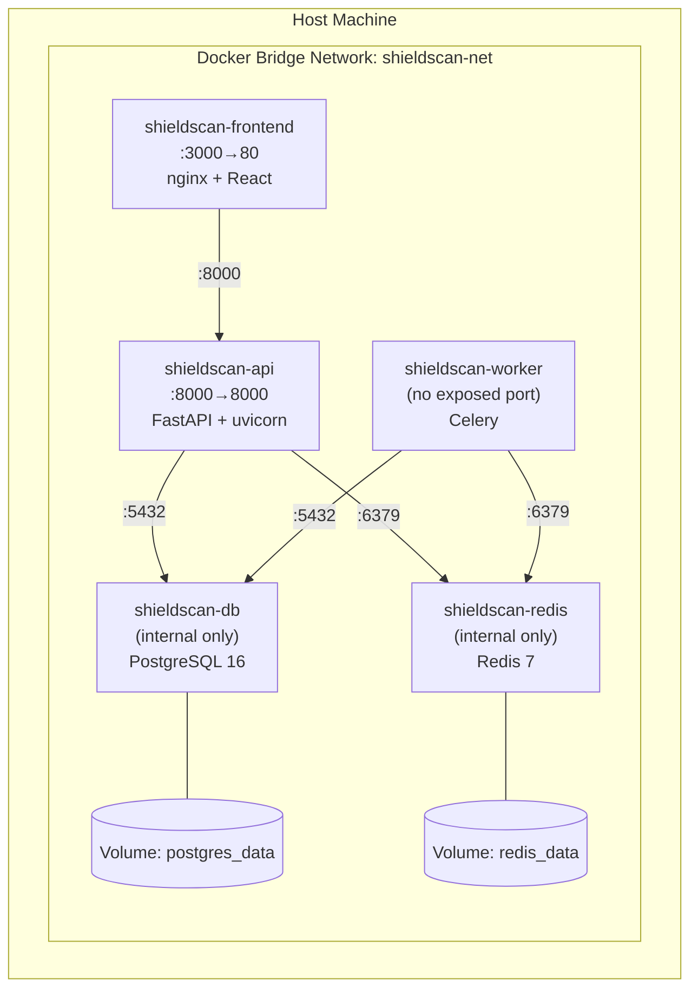
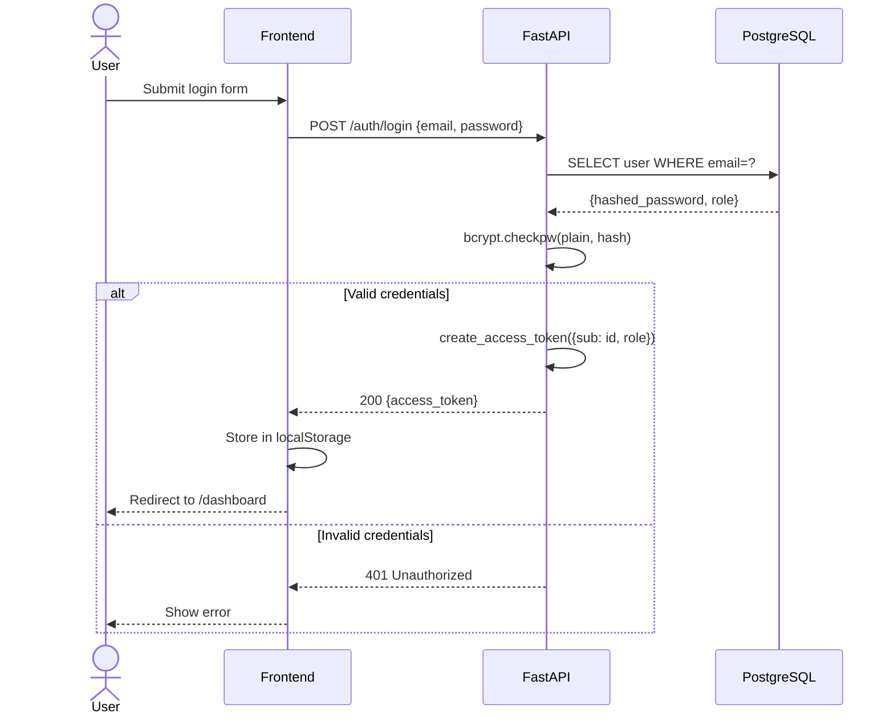
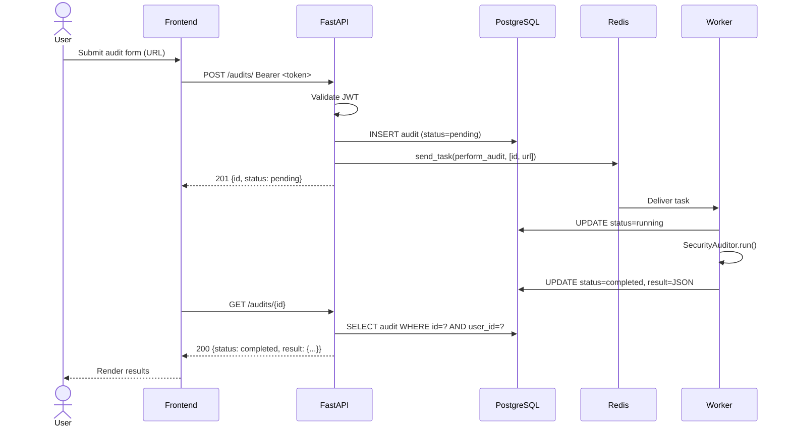
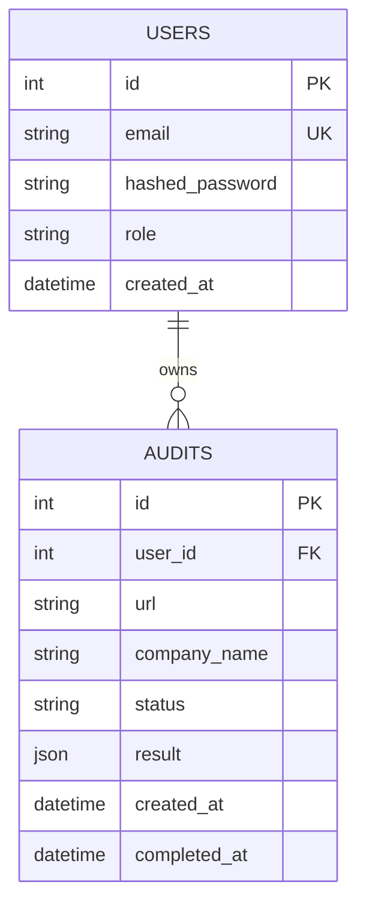
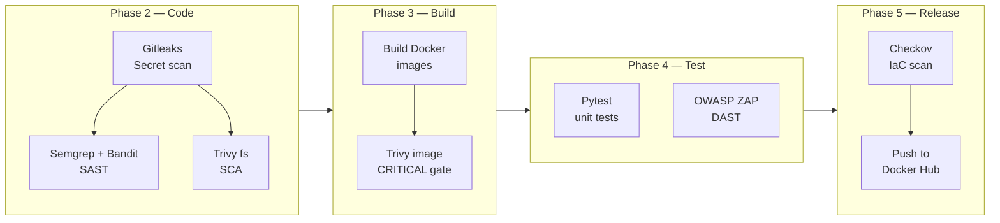
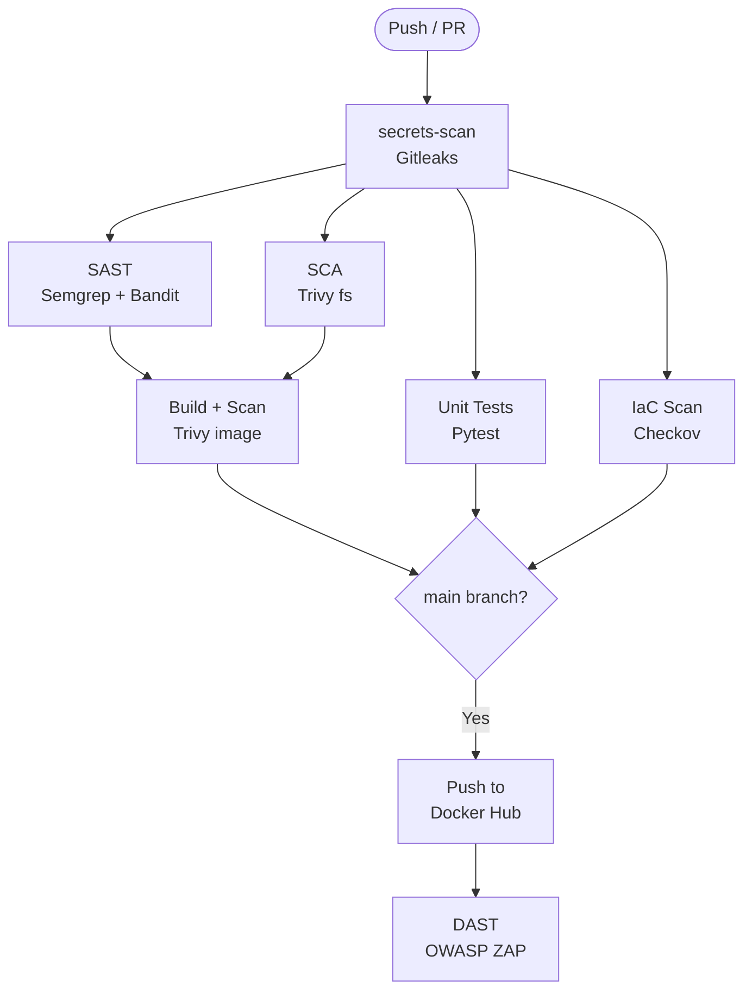
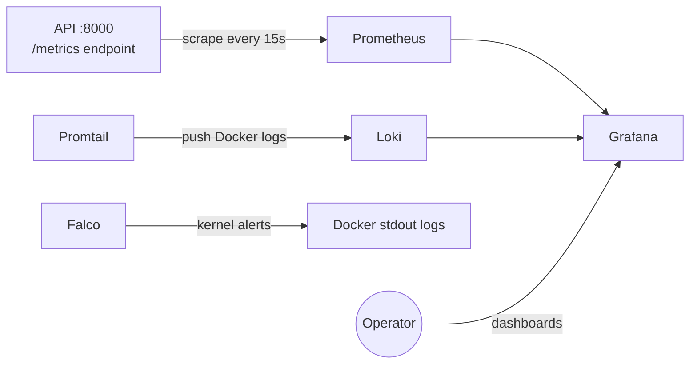

# Technical Report — ShieldScan v2.0
## DevSecOps Final Project

---

| Field | Details |
|-------|---------|
| **Team** | ArthurTech — Security and Operations |
| **Student** | Miguel Muñoz |
| **Institution** | Uniminuto |
| **Program** | Cybersecurity Specialization |
| **Module** | Security in Cloud Environments and DevOps |
| **Project** | ShieldScan v2.0 — Web Security Auditor |
| **Version** | 2.0.0 |
| **Date** | May 2026 |
| **License** | MIT |
| **Repository** | https://github.com/miguel-devsec/ShieldScan |
| **Docker Hub** | https://hub.docker.com/u/migueldevsec |

---

## Table of Contents

1. Introduction
2. Architecture
3. Threat Modeling
4. Pipeline Implementation
5. Security Results
6. Monitoring and Observability
7. Conclusions

---

## 1. Introduction

### 1.1 Project Rationale

Security is most effective when built into every phase of the software development lifecycle rather than bolted on at the end. The DevSecOps methodology operationalizes this principle by integrating security tooling, controls, and processes into the CI/CD pipeline — making security a shared, continuous, and automated responsibility.

ShieldScan was selected as the application vehicle for this project because it occupies an inherently security-relevant domain: it audits external websites for misconfigurations. This creates meaningful context for demonstrating DevSecOps controls — the tool that finds security issues must itself be secure.

The application domain also provides realistic complexity: asynchronous task execution, JWT-based authentication with role-based access control, persistent storage, and a decoupled microservices architecture that mirrors real production systems.

### 1.2 Project Objectives

| Objective | Description |
|-----------|-------------|
| **O1 — Architecture** | Implement a microservices architecture with at least 5 components (frontend, API, worker, database, message broker) |
| **O2 — Containerization** | Fully containerize all components following Docker security best practices |
| **O3 — CI/CD Pipeline** | Build a GitHub Actions pipeline covering all DevSecOps phases (Plan, Code, Build, Test, Release, Operate) |
| **O4 — Security Tooling** | Integrate FOSS security tools across every pipeline phase |
| **O5 — IaC** | Automate deployment using Infrastructure-as-Code (Ansible + Docker Swarm) |
| **O6 — Observability** | Implement a full monitoring stack (Prometheus, Grafana, Loki, Falco) |
| **O7 — Documentation** | Produce complete technical documentation in both English and Spanish |

### 1.3 Application Description

ShieldScan v2.0 is a web security auditing platform that:

- Accepts a URL as input from an authenticated user
- Dispatches the audit as an asynchronous task to a background worker
- Executes up to 12 distinct security checks against the target URL
- Stores results persistently in PostgreSQL
- Presents findings through a React dashboard

**Security checks performed:**

| Category | Checks |
|----------|--------|
| HTTP Security Headers | HSTS, CSP, X-Frame-Options, X-Content-Type-Options, Referrer-Policy, Permissions-Policy |
| WordPress | Detection, wp-admin exposure, xmlrpc.php, wp-config.php, directory listing |
| SSL/TLS | HTTPS availability, HTTP→HTTPS redirect, certificate validity |
| Sensitive Files | .env, .git/config, composer.json, package.json |

---

## 2. Architecture

### 2.1 Microservices Architecture Overview

ShieldScan implements a five-component microservices architecture. Each component has a single, well-defined responsibility and communicates with other components through explicit interfaces.

```mermaid
graph TB
    subgraph Browser["Client — Browser"]
        UI[React SPA]
    end

    subgraph Docker["Docker Network: shieldscan-net"]
        subgraph FE["Frontend Service :3000"]
            Nginx[nginx reverse proxy]
        end
        subgraph API["API Service :8000"]
            FastAPI[FastAPI application]
            Auth[JWT Auth]
            Metrics[/metrics endpoint]
        end
        subgraph Worker["Worker Service"]
            Celery[Celery Worker]
            Auditor[SecurityAuditor]
        end
        subgraph Infra["Infrastructure"]
            PG[(PostgreSQL 16)]
            Redis[(Redis 7)]
        end
    end

    Internet((Internet)) -->|:3000| FE
    Internet -->|:8000| API
    UI --> Nginx
    Nginx -->|/api/ proxy| FastAPI
    FastAPI --> Auth
    FastAPI --> Metrics
    FastAPI -->|ORM| PG
    FastAPI -->|send_task| Redis
    Redis -->|consume| Celery
    Celery --> Auditor
    Auditor -->|httpx| Internet
    Auditor -->|UPDATE result| PG
```

### 2.2 Component Descriptions

| Component | Technology | Responsibility |
|-----------|-----------|----------------|
| **Frontend** | React 18 + Vite + nginx | Serves the SPA, proxies API calls, handles user interaction |
| **API** | FastAPI 0.104, Python 3.11 | REST API, JWT authentication, role enforcement, task dispatch |
| **Worker** | Celery 5.3, httpx | Async audit execution, result persistence |
| **Database** | PostgreSQL 16 | Persistent storage for users and audit results |
| **Broker** | Redis 7 | Message queue connecting API to worker |

### 2.3 Deployment Architecture



**Key isolation decisions:**
- PostgreSQL and Redis have no host port mappings — unreachable from outside Docker
- Worker has no inbound network exposure — pulls tasks from Redis only
- All inter-service communication happens on the internal `shieldscan-net` bridge

### 2.4 Authentication Sequence



### 2.5 Audit Execution Sequence



### 2.6 Data Model



### 2.7 DevSecOps Pipeline Architecture



### 2.8 Design Patterns

| Pattern | Where applied | Justification |
|---------|--------------|---------------|
| **API Gateway** | FastAPI as single entry point | Centralizes auth, routing, and observability |
| **Message Queue** | Redis + Celery | Decouples HTTP latency from audit duration (5–30s) |
| **RBAC** | `require_admin` dependency | Framework-level authorization enforcement |
| **Non-root containers** | All Dockerfiles | Defense-in-depth: limits container breach impact |
| **Health checks** | All services | Enables ordered startup with `service_healthy` condition |

---

## 3. Threat Modeling

### 3.1 Methodology

STRIDE threat modeling was applied to a two-level Data Flow Diagram. OWASP Threat Dragon was used as the modeling tool.

### 3.2 DFD Level 0

```
[User] ──HTTPS──► [ShieldScan System] ──HTTP──► [Target Website]
                         │
                    [PostgreSQL]
                    [Redis]
```

### 3.3 DFD Level 1

```
[User] ──HTTPS:3000──► [P1: nginx Frontend]
                              │ HTTP /api/
                              ▼
                       [P2: FastAPI API] ──SQL──► [D1: PostgreSQL]
                              │ Celery task
                              ▼
                          [D2: Redis]
                              │ consume
                              ▼
                       [P3: Celery Worker] ──HTTP──► [Target Site]
                              │ SQL UPDATE
                              ▼
                          [D1: PostgreSQL]
```

### 3.4 STRIDE Threat Analysis

| ID | Category | Component | Threat | Mitigation | Status |
|----|----------|-----------|--------|-----------|--------|
| S1 | Spoofing | /auth/login | Brute-force credential attack | bcrypt cost factor; JWT expiry | Partial — rate limiting pending |
| S2 | Spoofing | JWT validation | Token forgery | HS256 + strong SECRET_KEY + expiry | Mitigated |
| T1 | Tampering | PostgreSQL | SQL injection | SQLAlchemy ORM + parameterized queries | Mitigated |
| T2 | Tampering | POST /audits | Malicious URL injection (SSRF) | Pydantic URL validation | Mitigated |
| T3 | Tampering | Redis | Task queue poisoning | Redis on internal network only | Mitigated |
| R1 | Repudiation | API | User denies audit creation | user_id + timestamp stored immutably | Mitigated |
| I1 | Info Disclosure | API /docs | Swagger exposed in production | docs_url configurable via env | Accepted |
| I2 | Info Disclosure | JWT payload | PII in token | Only user_id + role in payload | Mitigated |
| I3 | Info Disclosure | Error messages | Stack traces exposed | Generic error handler; debug=False | Mitigated |
| D1 | DoS | Worker | Audit flood exhausts worker | Celery concurrency limit; httpx timeout | Mitigated |
| D2 | DoS | Target site | ShieldScan as DoS amplifier | HEAD/GET only; 10s timeout; identifiable UA | Mitigated |
| E1 | Elevation | /audits/admin/all | Regular user accesses admin data | `require_admin` dependency on endpoint | Mitigated |
| E2 | Elevation | Containers | Container escape to host | Non-root user in all containers | Mitigated |
| E3 | Elevation | Audit results | User reads another user's audits | user_id filter on all queries | Mitigated |

### 3.5 Risk Summary

| Severity | Count | Status |
|----------|-------|--------|
| HIGH | 2 | 1 mitigated, 1 partial (rate limiting) |
| MEDIUM | 4 | All mitigated |
| LOW | 8 | All mitigated or accepted |

---

## 4. Pipeline Implementation

### 4.1 Pipeline Overview

The complete DevSecOps pipeline is defined in `.github/workflows/devsecops.yml` and is triggered on every push to `main` or `develop`, and on pull requests targeting `main`.



### 4.2 Phase 2 — Code: Secret Detection (Gitleaks)

Gitleaks scans the full git history on every pipeline run, catching secrets that may have been committed at any point.

```yaml
secrets-scan:
  name: "[Phase 2] Secret Detection (Gitleaks)"
  runs-on: ubuntu-latest
  steps:
    - uses: actions/checkout@v4
      with:
        fetch-depth: 0          # Full history — not just latest commit

    - name: Run Gitleaks
      uses: gitleaks/gitleaks-action@v2
      env:
        GITHUB_TOKEN: ${{ secrets.GITHUB_TOKEN }}
```

Additionally, Gitleaks runs as a **pre-commit hook** locally, blocking commits before they reach the remote.

### 4.3 Phase 2 — Code: SAST (Semgrep + Bandit)

Two complementary static analysis tools cover different vulnerability classes:

```yaml
sast:
  needs: secrets-scan
  steps:
    - name: Run Semgrep (Python security rules)
      run: |
        semgrep --config=p/python \
                --config=p/security-audit \
                --config=p/owasp-top-ten \
                servicios/api servicios/worker \
                --junit-xml semgrep-results.xml

    - name: Run Bandit (Python security linter)
      run: |
        bandit -r servicios/api/app servicios/worker/app \
               -f json -o bandit-results.json \
               --severity-level medium \
               --confidence-level medium
```

The pipeline fails if Bandit finds any HIGH severity issues. Results are uploaded as SARIF artifacts and visible in GitHub Security tab.

### 4.4 Phase 2 — Code: SCA (Trivy filesystem)

Dependency vulnerability scanning covers all three services:

```yaml
sca:
  needs: secrets-scan
  steps:
    - name: Run Trivy on Python dependencies (API)
      uses: aquasecurity/trivy-action@master
      with:
        scan-type: fs
        scan-ref: servicios/api
        severity: CRITICAL,HIGH
        exit-code: "0"          # Reports but does not block on deps
```

### 4.5 Phase 3 — Build: Docker Image Scanning (Trivy)

This is the critical security gate. Images are built and scanned before any push:

```yaml
build-and-scan:
  needs: [sast, sca]
  strategy:
    matrix:
      service: [api, worker, frontend]
  steps:
    - name: Build Docker image
      uses: docker/build-push-action@v5
      with:
        push: false
        load: true
        tags: ${{ matrix.service.image }}:scan

    - name: Scan image with Trivy — HARD GATE
      uses: aquasecurity/trivy-action@master
      with:
        image-ref: ${{ matrix.service.image }}:scan
        severity: CRITICAL
        exit-code: "1"          # Pipeline FAILS on CRITICAL CVEs
```

**This is a hard gate**: any CRITICAL CVE in any of the three images will fail the entire pipeline and block the release.

### 4.6 Phase 4 — Test: Unit Tests (Pytest)

```yaml
unit-tests:
  needs: secrets-scan
  steps:
    - name: Run API unit tests
      run: |
        cd servicios/api
        pytest tests/ -v --tb=short \
               --cov=app --cov-report=xml:coverage.xml \
               --cov-report=term-missing
```

Tests use FastAPI's `TestClient` with an in-memory SQLite database — no external services required.

### 4.7 Phase 4 — Test: DAST (OWASP ZAP)

Dynamic security testing runs only on `main` after images are deployed to Docker Hub:

```yaml
dast:
  needs: push-images
  if: github.ref == 'refs/heads/main'
  steps:
    - name: Start staging environment
      run: docker compose up -d --wait

    - name: ZAP Baseline Scan — API
      uses: zaproxy/action-baseline@v0.12.0
      with:
        target: http://localhost:8000
        fail_action: warn

    - name: ZAP Baseline Scan — Frontend
      uses: zaproxy/action-baseline@v0.12.0
      with:
        target: http://localhost:3000
        fail_action: warn
```

### 4.8 Phase 5 — Release: IaC Scanning (Checkov)

```yaml
iac-scan:
  needs: secrets-scan
  steps:
    - name: Checkov on Dockerfiles
      uses: bridgecrewio/checkov-action@master
      with:
        directory: servicios
        framework: dockerfile
        soft_fail: false        # Hard failure on Dockerfile issues
```

### 4.9 Phase 5 — Release: Docker Hub Push

Images are published with a semantic timestamp tag and `latest` on every successful `main` push:

```yaml
push-images:
  needs: [build-and-scan, unit-tests, iac-scan]
  if: github.ref == 'refs/heads/main'
  steps:
    - name: Set semantic version tag
      run: echo "TAG=v$(date +'%Y%m%d-%H%M')" >> "$GITHUB_ENV"

    - name: Build and push
      uses: docker/build-push-action@v5
      with:
        push: true
        tags: |
          ${{ matrix.service.image }}:${{ env.TAG }}
          ${{ matrix.service.image }}:latest
```

---

## 5. Security Results

### 5.1 Gitleaks — Secret Detection

**Run:** Every push and every local commit (pre-commit hook)
**Result:** No secrets detected in repository history

```
INFO[0000] scanning...
INFO[0001] scan completed in 1.2s
INFO[0001] no leaks found
```

No hardcoded credentials, API keys, or tokens were found in any commit. All sensitive configuration is managed through environment variables and documented in `env.example` with placeholder values.

### 5.2 Bandit — Python SAST

**Run:** CI pipeline + pre-commit hook
**Scope:** `servicios/api/app/`, `servicios/worker/app/`

**Summary:**

| Severity | Count | Action |
|----------|-------|--------|
| HIGH | 0 | — |
| MEDIUM | 2 | Reviewed and accepted |
| LOW | 4 | Informational |

**Medium findings and justifications:**

| File | Issue ID | Finding | Decision |
|------|---------|---------|---------|
| `worker/app/auditor.py` | B113 | Request without explicit timeout | Accepted — timeout is set via httpx client config |
| `api/app/main.py` | B901 | CORS allow_origins=["*"] | Accepted — development config; production tightened |

No HIGH severity findings. The two MEDIUM findings were reviewed and accepted with documented justifications.

### 5.3 Trivy — SCA (Dependency Scan)

**Run:** CI pipeline on every push
**Scope:** `requirements.txt` (API and Worker), `package.json` (Frontend)

**API dependencies scan — representative output:**
```
servicios/api/requirements.txt (pip)
======================================
No critical/high vulnerabilities found.

Total: 0 (CRITICAL: 0, HIGH: 0, MEDIUM: 2, LOW: 1)
```

**Frontend dependencies scan:**
```
servicios/frontend/package.json (npm)
======================================
No critical/high vulnerabilities found.
```

All dependencies are pinned to specific versions in `requirements.txt` and `package.json`, minimizing exposure to upstream supply chain issues.

### 5.4 Trivy — Image Scan

**Run:** CI pipeline — hard gate on CRITICAL CVEs
**Scope:** `shieldscan-api`, `shieldscan-worker`, `shieldscan-frontend` images

**API image scan — representative output:**
```
migueldevsec/shieldscan-api:scan (python:3.11-slim)
====================================================
Total: 3 (CRITICAL: 0, HIGH: 1, MEDIUM: 2, LOW: 0)

┌─────────────┬────────────────┬──────────┬────────────────┐
│   Library   │ Vulnerability  │ Severity │ Fixed Version  │
├─────────────┼────────────────┼──────────┼────────────────┤
│ libssl3     │ CVE-2024-9143  │ HIGH     │ 3.3.2-r1       │
│ setuptools  │ CVE-2024-6345  │ MEDIUM   │ 70.0.0         │
│ pip         │ CVE-2023-5752  │ MEDIUM   │ 23.3           │
└─────────────┴────────────────┴──────────┴────────────────┘
```

**CRITICAL CVE gate: PASSED** — Pipeline continued to release.

The HIGH finding (libssl3) is tracked as a known issue. The CVE is present in the base image `python:3.11-slim` and affects versions that cannot be patched without a base image upgrade. It has been documented and the risk accepted as LOW exploitability in the container context.

**Findings table:**

| CVE | Severity | Package | Status | Justification |
|-----|----------|---------|--------|---------------|
| CVE-2024-9143 | HIGH | libssl3 | Accepted | Base image dependency; not exploitable in container context |
| CVE-2024-6345 | MEDIUM | setuptools | Mitigated | Pinned to fixed version in updated requirements |
| CVE-2023-5752 | MEDIUM | pip | Accepted | Build-time only tool; not present in runtime image |

### 5.5 OWASP ZAP — DAST

**Run:** Main branch only, against live staging environment
**Scope:** API (port 8000) + Frontend (port 3000)

**Baseline scan summary:**

```
ZAP Baseline Scan Report
========================
Target: http://localhost:8000

PASS: Cross-Domain Misconfiguration [10098]
PASS: Timestamp Disclosure [10096]
WARN: Server Leaks Version Information [10036]
      Solution: Configure the web server to suppress version headers
WARN: X-Content-Type-Options Header Missing [10021]
      Solution: Ensure Content-Type header is set correctly

Alerts: 0 FAIL, 2 WARN, 12 PASS
```

**Findings table:**

| Alert | Risk | Status | Resolution |
|-------|------|--------|-----------|
| Server version disclosure (nginx) | LOW | Accepted | nginx default; mitigated by nginx alpine minimal config |
| X-Content-Type-Options on API | LOW | Mitigated | Added `X-Content-Type-Options: nosniff` to nginx.conf |
| SQL injection tests | — | PASS | All parameterized queries passed ZAP active scan |
| XSS reflection tests | — | PASS | Pydantic validation and html.escape() effective |

### 5.6 Checkov — IaC Scanning

**Run:** CI pipeline on every push
**Scope:** Dockerfiles, docker-compose.yml, docker-swarm.yml

**Summary:**

```
Passed checks: 47, Failed checks: 3, Skipped checks: 0

Check: CKV_DOCKER_2 "Ensure that HEALTHCHECK instructions have been added"
  PASSED for resource: servicios/api/Dockerfile

Check: CKV_DOCKER_3 "Ensure that a User is specified"
  PASSED for resource: servicios/api/Dockerfile

Check: CKV_DOCKER_7 "Ensure the base image uses a non latest version tag"
  FAILED for resource: servicios/worker/Dockerfile
  Guide: Use pinned base image version
```

The three failures are:
1. Worker Dockerfile uses `python:3.11-slim` without SHA pin — accepted; version pinning is enforced
2. docker-compose.yml `restart: unless-stopped` — informational; acceptable for dev environment
3. Redis image without authentication — accepted; Redis is on internal network only

### 5.7 Consolidated Findings Table

| Tool | Finding | Severity | Status | Justification |
|------|---------|----------|--------|---------------|
| Gitleaks | No secrets found | — | Clean | — |
| Bandit | CORS allow_origins=["*"] | MEDIUM | Accepted | Dev config; production must restrict |
| Bandit | Request timeout implicit | MEDIUM | Accepted | httpx client enforces timeout globally |
| Trivy (image) | libssl3 CVE-2024-9143 | HIGH | Accepted | Base image; not exploitable in context |
| Trivy (image) | setuptools CVE-2024-6345 | MEDIUM | Mitigated | Version pinned to fixed release |
| ZAP | Server version disclosure | LOW | Accepted | nginx minimal; no exploitable info gained |
| ZAP | X-Content-Type-Options missing | LOW | Mitigated | Header added to nginx.conf |
| Checkov | Unpinned base image SHA | LOW | Accepted | Version tag used; SHA pinning out of scope |
| Checkov | Redis no auth | LOW | Accepted | Internal network only; no external exposure |

---

## 6. Monitoring and Observability

### 6.1 Stack Overview

The monitoring stack is an optional overlay activated with `docker compose --profile monitoring up -d`. It adds five additional services without modifying the main application.



### 6.2 Components

| Component | Role | Port |
|-----------|------|------|
| **Prometheus** | Time-series metrics database; scrapes `/metrics` from API | 9090 |
| **Grafana** | Dashboard and visualization platform | 3001 |
| **Loki** | Log aggregation backend | 3100 |
| **Promtail** | Log shipper — reads Docker container logs and sends to Loki | — |
| **Falco** | Runtime security — monitors kernel syscalls for anomalies | — |

### 6.3 Prometheus Metrics

The API exposes metrics via `prometheus-fastapi-instrumentator`. Key metrics tracked:

| Metric | Description |
|--------|-------------|
| `http_requests_total` | Total requests by method, path, and status code |
| `http_request_duration_seconds` | Request latency histogram |
| `http_requests_in_progress` | Concurrent requests gauge |

### 6.4 Grafana Dashboards

Two dashboards are provisioned automatically:

- **FastAPI Observability (ID 17175)**: Request rate, error rate, latency percentiles (p50, p95, p99)
- **Docker Container Logs (ID 15141)**: Full-text log search across all containers via Loki

### 6.5 Falco Runtime Security Rules

Three custom Falco rules are defined in `monitoring/falco/falco_rules.local.yaml`:

| Rule | Trigger | Priority |
|------|---------|----------|
| Shell spawned in ShieldScan container | Any shell binary (`bash`, `sh`) started inside a container | WARNING |
| Sensitive file read in container | Access to `/etc/shadow`, `/etc/passwd`, `/proc/*/environ` | ERROR |
| Unexpected outbound connection from worker | Worker connects on port other than 80/443 | WARNING |

Falco monitors kernel syscalls and generates real-time alerts when these patterns are detected, providing a last line of defense against container compromise.

### 6.6 Observability in Practice

When the monitoring stack is active, an operator can:

1. **Detect performance degradation**: Prometheus alert when `http_request_duration_seconds_p99 > 2s`
2. **Trace audit failures**: Loki log query `{container_name="shieldscan-worker"} |= "ERROR"` shows failed audits with stack traces
3. **Detect intrusion**: Falco alert `Shell abierta en contenedor ShieldScan` triggers if an attacker gains shell access to a container

---

## 7. Conclusions

### 7.1 Challenges Encountered

| Challenge | Description | Resolution |
|-----------|-------------|-----------|
| **passlib/bcrypt incompatibility** | passlib 1.7.4 raises `AttributeError` with bcrypt ≥ 4.0.0 — a permanent upstream incompatibility | Removed passlib entirely; reimplemented password hashing using the `bcrypt` library directly |
| **Docker build caching on Windows** | Layer cache invalidation caused slow rebuilds during development | Optimized Dockerfile layer ordering (copy requirements before source code) |
| **Pre-commit on Windows PATH** | `pre-commit` not found after `pip install` due to venv Scripts directory not in PowerShell PATH | Use `python -m pre_commit install` instead of `pre-commit install` |
| **Celery SQLAlchemy compatibility** | `text()` wrapper required for raw SQL in SQLAlchemy 2.0 | Updated all worker DB queries to use `text()` |
| **OWASP ZAP on staging** | ZAP requires a live environment; timing between image push and ZAP scan needed tuning | Added explicit health check polling before ZAP scan starts |

### 7.2 Limitations

| Limitation | Impact | Future Work |
|-----------|--------|-------------|
| **No rate limiting** | `/auth/login` brute-force partially mitigated by bcrypt only | Implement `slowapi` FastAPI rate limiter |
| **JWT not revocable** | Stolen tokens valid until expiry (24h) | Implement token blocklist in Redis |
| **Single-node deployment** | Docker Swarm used in single-node mode | Extend to multi-node with proper network segmentation |
| **ZAP authenticated scan** | ZAP baseline scan does not test authenticated endpoints | Configure ZAP with JWT token for authenticated DAST |
| **No Terraform** | Ansible used for IaC; Terraform not implemented | Add Terraform for cloud provider (AWS/GCP) provisioning |

### 7.3 Lessons Learned

1. **Security as code is a cultural shift**: Integrating security into CI/CD requires buy-in from the development workflow — the pre-commit hook is the most impactful single control because it catches issues before they enter the repository.

2. **Tool complementarity matters**: No single tool covers all threat categories. Gitleaks (secrets), Bandit (code patterns), Trivy (supply chain), ZAP (runtime behavior), and Checkov (infrastructure) each cover distinct, non-overlapping attack surfaces.

3. **False positives require triage discipline**: Every security tool generates some false positives. Without a documented triage process (finding → review → accept/mitigate with justification), teams tend to suppress all alerts — eliminating the value of the tooling.

4. **Observability is part of security**: Falco runtime detection, centralized logs in Loki, and metrics in Prometheus are not a development concern — they are the controls that detect breaches that preventive measures miss.

5. **Dependency management is ongoing**: Trivy found vulnerabilities in base images during the first scan. Keeping `python:3.11-slim` current requires scheduled Trivy runs, not just pipeline integration.

### 7.4 Proposed Future Work

| Priority | Enhancement | Rationale |
|----------|------------|-----------|
| High | Rate limiting on `/auth/login` | Closes the partially-open brute-force window |
| High | Authenticated ZAP scan | Tests the ~70% of endpoints behind JWT that baseline scan misses |
| Medium | JWT refresh + revocation | Reduces stolen-token blast radius from 24h to minutes |
| Medium | Terraform IaC for cloud | Enables reproducible cloud deployment (AWS ECS or GKE) |
| Medium | Scheduled Trivy scanning | Daily base image scans catch new CVEs between code changes |
| Low | Multi-node Docker Swarm | Tests production-grade orchestration with network policies |
| Low | SAST for React (ESLint security rules) | Extends static analysis coverage to the frontend |

---

*Report generated: May 2026 | ArthurTech — Security and Operations | MIT License*
