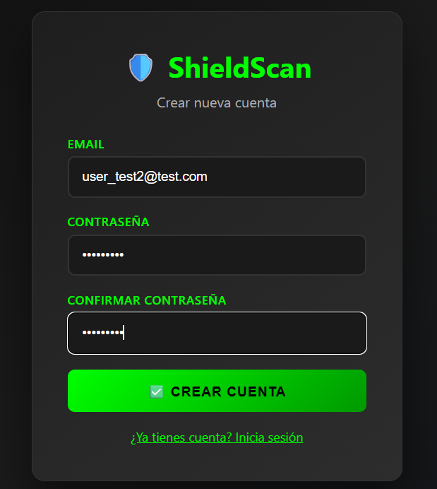
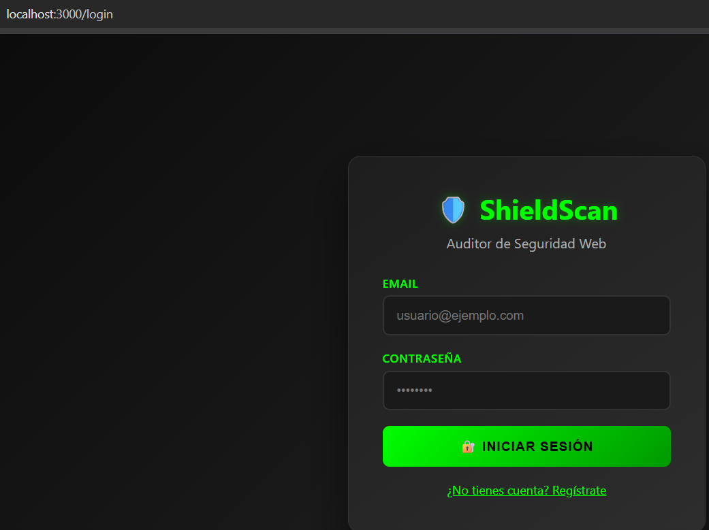
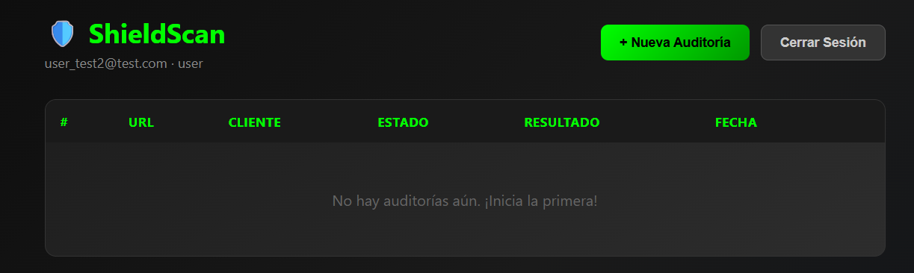
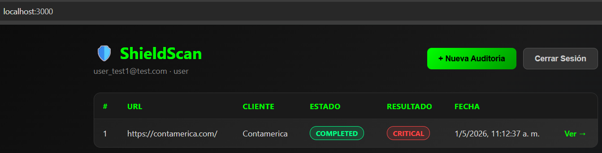
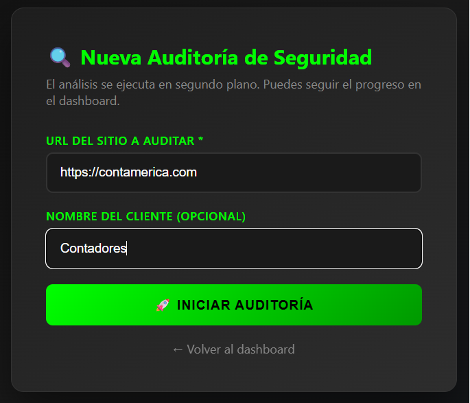
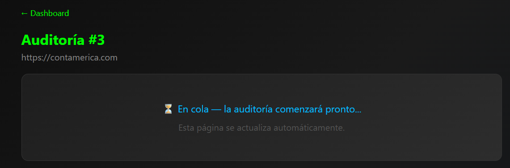
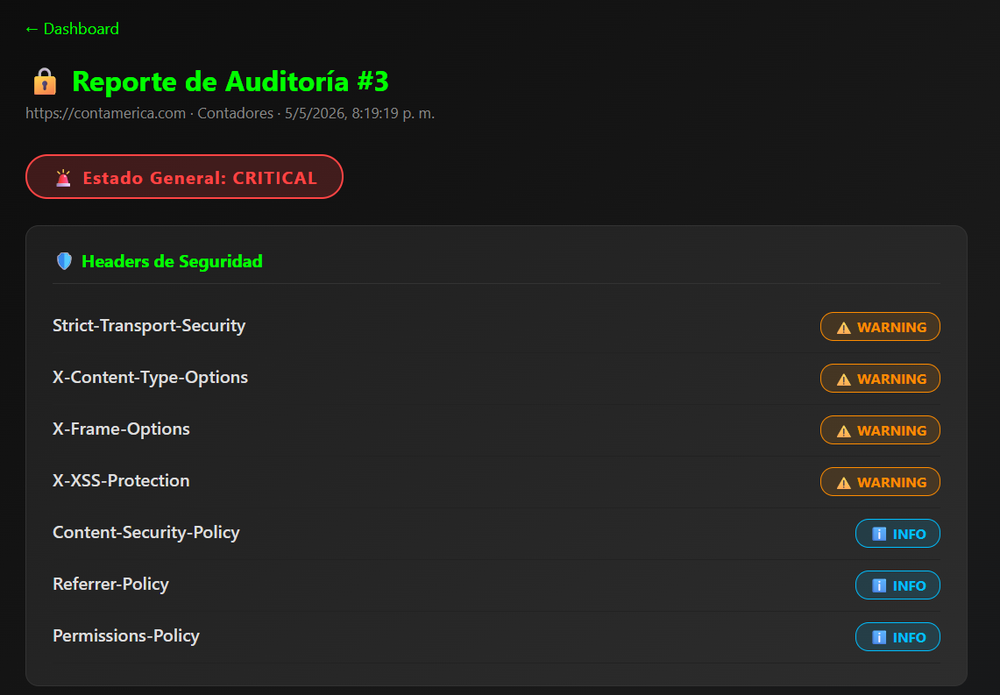
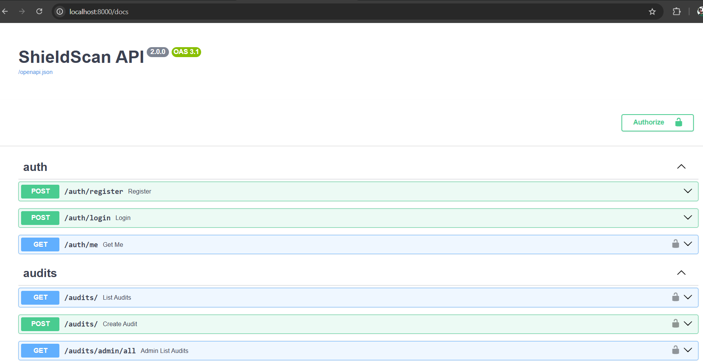

# User Manual — ShieldScan v2.0

## What is ShieldScan?

ShieldScan is a web security auditing tool that automatically analyzes websites for common security misconfigurations. You enter a URL, and within seconds ShieldScan inspects the site's HTTP headers, WordPress configuration, SSL/TLS setup, and sensitive file exposure — then presents a structured report with findings.

---

## 1. Getting Started

### 1.1 Accessing the application

Open your browser and navigate to:

```
http://localhost:3000
```

You will see the ShieldScan landing page with options to **Register** or **Login**.

---

## 2. Creating an Account

### 2.1 Registration

Click **Register** (or navigate to `/register`).

Fill in the registration form:

| Field | Requirements |
|-------|-------------|
| **Email** | A valid email address; used as your username |
| **Password** | Minimum 8 characters; stored with bcrypt hashing |



Click **Create Account**. On success, you are redirected to the login page.

> **Note:** New accounts start with the `user` role. Admin access must be granted manually by an administrator.

### 2.2 Login

Click **Login** (or navigate to `/login`).

Enter your email and password, then click **Sign In**.



On success, a JWT token is stored in your browser's localStorage and you are redirected to the **Dashboard**.

> **Security note:** The token expires after 24 hours. If you see a "session expired" message, simply log in again.

---

## 3. Dashboard

The Dashboard is your home screen after logging in. It shows:

- A summary of your recent audits
- A button to start a new audit
- Status indicators for each audit (Pending, Running, Completed, Failed)



### Dashboard columns

| Column | Description |
|--------|-------------|
| **ID** | Unique audit identifier |
| **URL** | The target URL that was audited |
| **Company** | The label you assigned to the audit |
| **Status** | Current state of the audit |
| **Created** | Date and time the audit was started |
| **Action** | Link to view the full audit report |



---

## 4. Running a Security Audit

### 4.1 Starting an audit

From the Dashboard, click **New Audit** (or navigate to `/audit/new`).

Fill in the form:

| Field | Description | Example |
|-------|-------------|---------|
| **URL** | The website to audit | `https://example.com` |
| **Company / Label** | A name to identify this audit | `Client ACME Corp` |



Click **Start Audit**.

ShieldScan:
1. Creates an audit record with status `pending`
2. Queues the audit task for the background worker
3. Redirects you to the audit detail page

### 4.2 Audit execution

The audit runs asynchronously — the page will show a loading indicator while the worker processes the request. The typical audit takes **5–20 seconds** depending on the target site's response time.



Status lifecycle:

```
pending → running → completed
                 ↘ failed
```

The page auto-refreshes until the audit reaches a terminal state.

---

## 5. Reading Audit Results

When the audit completes, the results page shows a structured report divided into sections.



### 5.1 Security Score

The top of the report shows an overall score and a risk summary indicating how many issues were found at each severity level.

### 5.2 HTTP Security Headers

ShieldScan checks for the presence and correct configuration of these headers:

| Header | Purpose | Result |
|--------|---------|--------|
| `Strict-Transport-Security` | Forces HTTPS connections | Present / Missing |
| `Content-Security-Policy` | Prevents XSS attacks | Present / Missing |
| `X-Frame-Options` | Prevents clickjacking | Present / Missing |
| `X-Content-Type-Options` | Prevents MIME-type sniffing | Present / Missing |
| `Referrer-Policy` | Controls referrer information | Present / Missing |
| `Permissions-Policy` | Restricts browser feature access | Present / Missing |

**How to read the result:** A green checkmark means the header is present and configured. A red X means the header is missing, which represents a security misconfiguration.

### 5.3 WordPress Detection

If the target site runs WordPress, ShieldScan reports:

- **Confidence score**: How certain the detection is (0–100%)
- **Detection signals**: What indicators were found (login page, readme file, generator meta tag, etc.)

### 5.4 WordPress-Specific Checks

For detected WordPress sites, ShieldScan checks:

| Check | Risk if exposed | What to do |
|-------|----------------|-----------|
| `/wp-admin/` accessible | Admin interface exposed | Restrict via IP or 2FA |
| `xmlrpc.php` accessible | Brute-force, DDoS amplification | Disable if not needed |
| `wp-config.php` readable | Database credentials exposed | Fix file permissions |
| `wp-content/uploads/` listing | Directory contents exposed | Disable directory listing |

### 5.5 SSL / HTTPS Configuration

| Check | Description |
|-------|-------------|
| **HTTPS available** | Site responds on HTTPS |
| **HTTP→HTTPS redirect** | HTTP requests are redirected to HTTPS |
| **SSL certificate valid** | Certificate is trusted and not expired |

### 5.6 Sensitive Files Exposed

ShieldScan probes for commonly exposed sensitive files:

| File | Risk |
|------|------|
| `.env` | Exposed environment variables with secrets |
| `.git/config` | Git repository configuration with remote URLs |
| `composer.json` | PHP dependency configuration |
| `package.json` | Node.js dependency configuration |

If any of these files return an HTTP 200 response, they are flagged as **exposed** — a serious vulnerability.

### 5.7 Directory Listing

ShieldScan checks if the web server returns a directory listing instead of a 403 or 404. Directory listing exposes the file structure of the application.

---

## 6. Audit History

All your past audits are visible on the Dashboard. You can:

- **View** any past audit by clicking its ID or the "View" button
- **Sort** by creation date (most recent first)
- **Re-audit** a site by starting a new audit with the same URL

Audit results are stored permanently in the database — you can access them at any time.

---

## 7. Admin Features

Users with the `admin` role have access to additional capabilities.

### 7.1 Viewing all audits

Admins can see audits from **all users** by navigating to the admin panel or via the API at `/audits/admin/all`.

### 7.2 Promoting a user to admin

This must be done by an existing admin via the database:

```bash
docker exec -it shieldscan-db psql -U shieldscan -d shieldscan \
  -c "UPDATE users SET role='admin' WHERE email='user@example.com';"
```

---

## 8. Logging Out

Click the **Logout** button in the navigation bar (or clear your browser's localStorage). This removes your JWT token from the browser — no server-side session invalidation is required.

---

## 9. Frequently Asked Questions

**Q: How long does an audit take?**
A: Typically 5–20 seconds, depending on the target site's response time and how many checks are performed.

**Q: Can I audit any website?**
A: ShieldScan sends only passive HTTP HEAD and GET requests — the same requests your browser would make. Only audit sites you own or have explicit permission to test.

**Q: Why does an audit show "failed"?**
A: Common causes: the target URL is unreachable, the connection timed out (> 10 seconds), or the server returned an error. The audit will be retried up to 2 times automatically before marking as failed.

**Q: Is my data private?**
A: Yes. Each user can only see their own audits. Admin users can see all audits.

**Q: Can I export audit results?**
A: Currently, results are available via the API at `GET /audits/{id}` in JSON format. Download by visiting `http://localhost:8000/audits/{id}` with your JWT token via the API explorer at `/docs`.

**Q: The audit is stuck on "pending" — what's wrong?**
A: The Celery worker may not be running. Check with:
```bash
docker compose ps worker
docker compose logs worker
```

---

## 10. API Access

Advanced users can access the API directly. The interactive documentation is available at:

```
http://localhost:8000/docs
```



To authenticate in the Swagger UI:
1. `POST /auth/login` with your credentials
2. Copy the `access_token` from the response
3. Click **Authorize** at the top right
4. Paste the token in the `HTTPBearer` field
5. All subsequent requests will include your token
