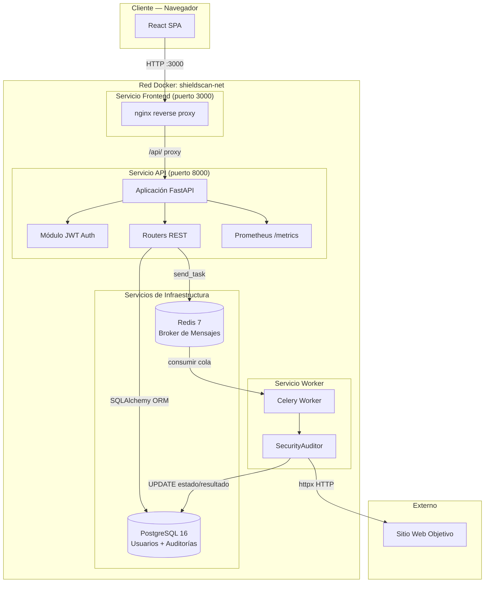
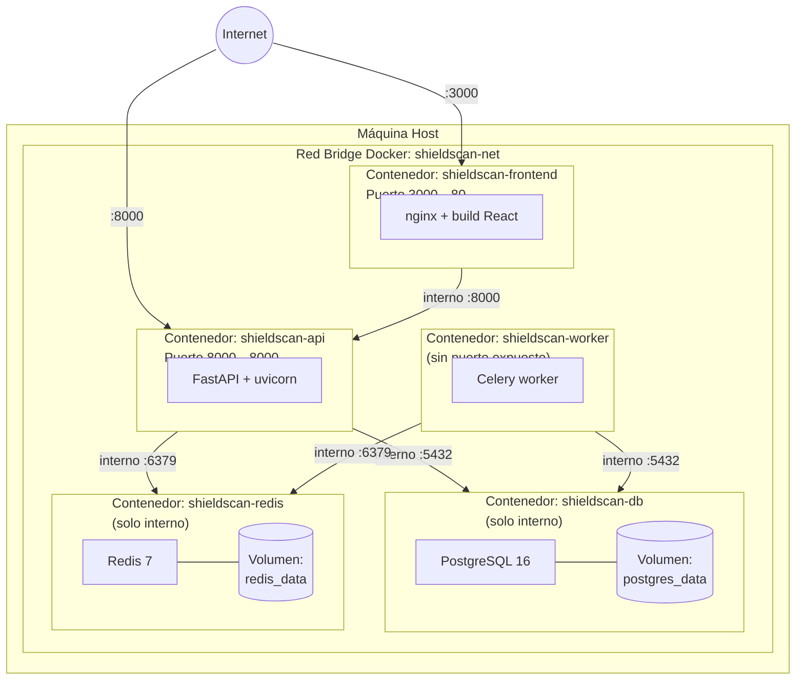
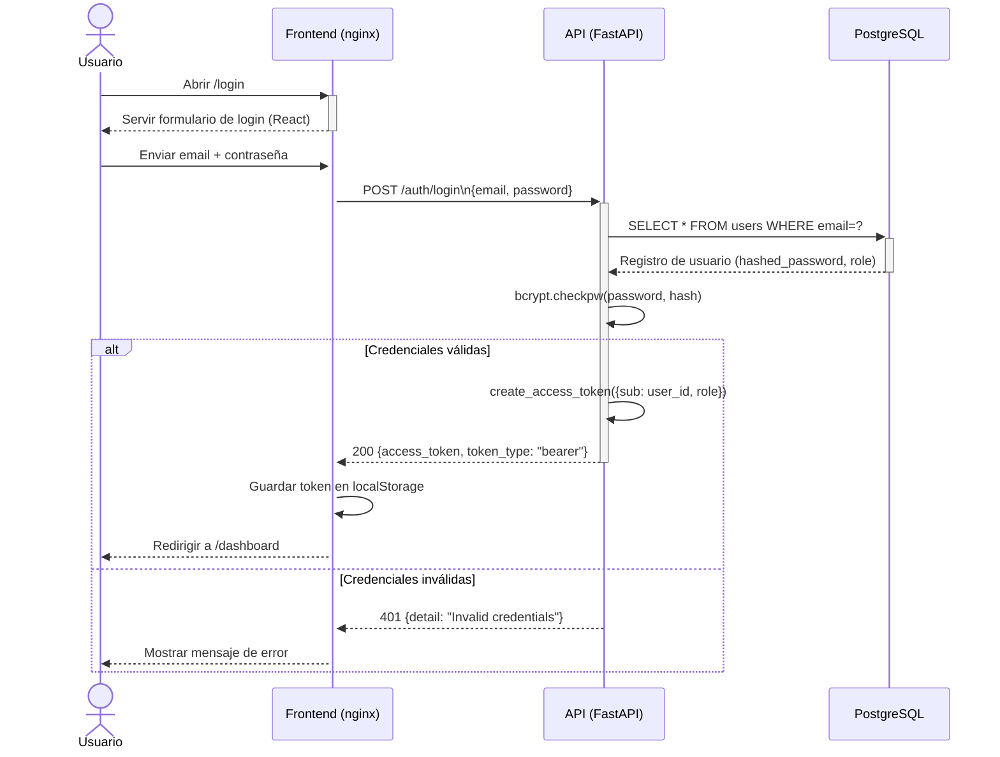
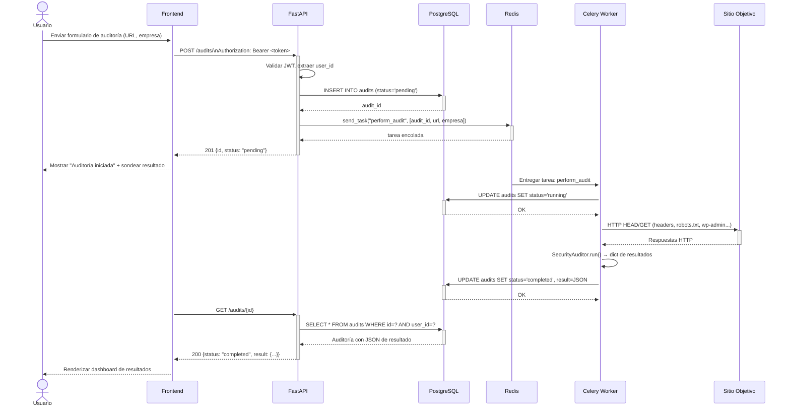
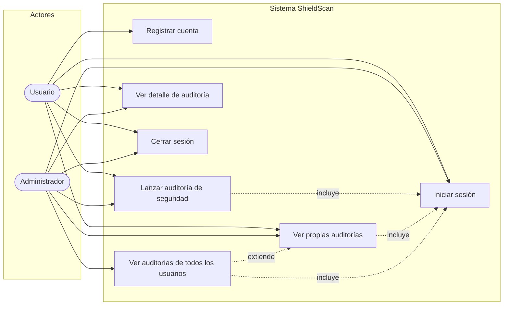
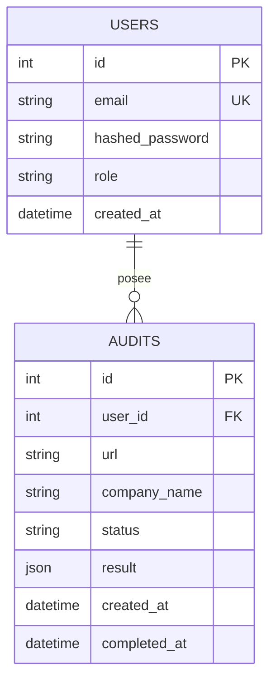
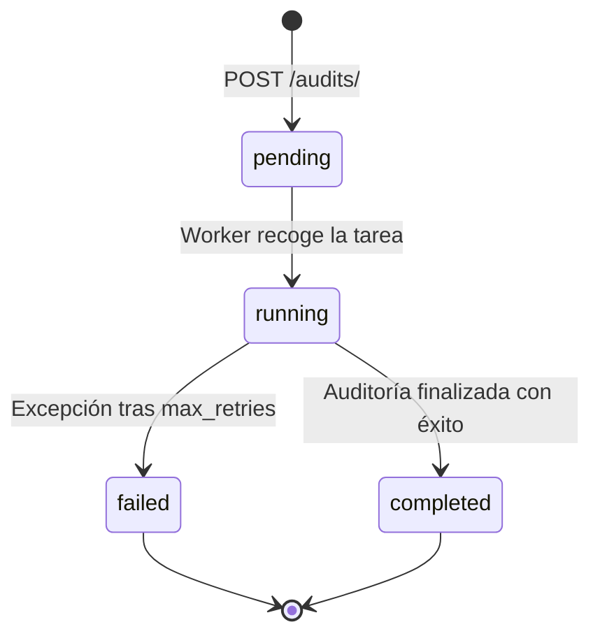

# Manual de Arquitectura — ShieldScan v2.0

## 1. Visión General

ShieldScan es una plataforma de auditoría de seguridad web diseñada con una **arquitectura de microservicios**. El sistema desacopla las responsabilidades en servicios independientes y desplegables que se comunican mediante interfaces bien definidas: una API REST síncrona y una cola de mensajes asíncrona.

El principio de diseño central es la **separación de responsabilidades**: la API gestiona la autenticación, autorización y despacho de solicitudes; el worker gestiona el proceso de auditoría de larga duración e intensivo en I/O; el frontend gestiona la interacción con el usuario. Esta separación permite escalado, despliegue y dominios de fallo independientes.

---

## 2. Diagrama de Componentes

### Responsabilidades de cada componente

| Componente | Responsabilidad | Tecnología |
|-----------|----------------|-----------|
| **nginx** | Servir el build estático de React; proxear `/api/*` a FastAPI | nginx:alpine |
| **FastAPI** | API REST, autenticación JWT, control de roles, despacho a Celery | Python 3.11, FastAPI 0.104 |
| **Celery Worker** | Consumir tareas de auditoría desde Redis, ejecutar verificaciones de seguridad, escribir resultados en BD | Celery 5.3, httpx |
| **PostgreSQL** | Almacenamiento persistente de usuarios y resultados de auditoría | PostgreSQL 16 |
| **Redis** | Broker de mensajes asíncrono entre API y worker | Redis 7 |

---

## 3. Diagrama de Despliegue

### Decisiones de diseño

- **PostgreSQL y Redis no están expuestos al host** — solo accesibles dentro de la red bridge Docker. Esto elimina la superficie de ataque externa directa.
- **El frontend usa nginx como servidor de archivos estáticos y proxy de API** — evita las solicitudes preflight CORS desde el navegador y centraliza el punto de entrada.
- **El worker no tiene puerto expuesto** — solo consume de la cola Redis. No existe ruta de red entrante al worker.
- **Los volúmenes son volúmenes Docker con nombre**, no bind mounts — garantiza que los datos persisten entre reinicios de contenedores y evita problemas de permisos de sistema de archivos.

---

## 4. Diagrama de Secuencia — Flujo de Autenticación

### Diagrama de Secuencia — Flujo de Ejecución de Auditoría

---

## 5. Diagrama de Casos de Uso

### Definición de actores

| Actor | Descripción |
|-------|-------------|
| **Usuario** | Usuario autenticado con acceso estándar; solo puede ver sus propias auditorías |
| **Administrador** | Rol elevado; puede ver todas las auditorías de todos los usuarios mediante `/audits/admin/all` |

---

## 6. Modelo de Datos

### Ciclo de vida del estado de una auditoría

---

## 7. Patrones de Diseño

| Patrón | Dónde se aplica | Justificación |
|--------|----------------|---------------|
| **API Gateway** | FastAPI es el único punto de entrada para todas las solicitudes del cliente | Centraliza auth, rate limiting y enrutamiento |
| **Cola de mensajes** | Redis + Celery desacopla la ejecución de auditorías de la solicitud HTTP | Las solicitudes HTTP retornan en < 200ms; las auditorías tardan 5–30s |
| **Patrón Repository** | SQLAlchemy Session + modelos ORM | Desacopla la lógica de negocio del SQL; permite pruebas unitarias sin BD real |
| **Control de acceso basado en roles** | Dependencia `require_admin` en FastAPI | Aplica la autorización a nivel del framework, no en la lógica de negocio |
| **Contenedores no-root** | Todos los Dockerfiles cambian a usuario no-root | Defensa en profundidad: limita el radio de explosión si un contenedor es comprometido |
| **Health checks** | Todos los servicios Docker definen `HEALTHCHECK` | Permite `depends_on: condition: service_healthy` en Docker Compose, evitando condiciones de carrera al arrancar |

---

## 8. Justificación de Tecnologías

| Elección | Alternativas consideradas | Por qué se eligió |
|----------|--------------------------|-------------------|
| **FastAPI** sobre Flask | Flask, Django | Documentación OpenAPI automática, soporte async nativo, validación Pydantic |
| **Celery + Redis** sobre threading | Hilos Python, asyncio | Cola de tareas persistente, lógica de reintentos, escalado horizontal de workers |
| **PostgreSQL** sobre SQLite | SQLite, MySQL | Grado producción, ACID compliant, soporte de columna JSON |
| **bcrypt directo** sobre passlib | passlib | passlib 1.7.4 no tiene mantenimiento e incompatible con bcrypt ≥ 4.0.0 |
| **JWT** sobre cookies de sesión | Cookies de sesión | Sin estado — funciona entre microservicios; sin almacenamiento de sesión en servidor |
| **nginx** como servidor frontend | Node.js serve, Apache | Mínima huella, proxy inverso integrado, probado en producción |
