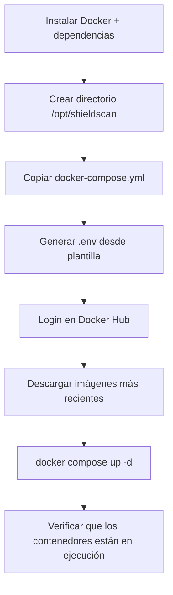

# Guía de Despliegue y Operaciones — ShieldScan v2.0

## 1. Opciones de Despliegue

| Opción | Caso de uso | Complejidad |
|--------|-------------|------------|
| **Docker Compose** | Desarrollo local, staging en servidor único | Baja |
| **Docker Swarm** | Producción en servidor único con orquestación | Media |
| **Ansible automatizado** | Despliegue reproducible en un servidor limpio | Media |

---

## 2. Prerrequisitos

### Requisitos del servidor objetivo

- Ubuntu 22.04 LTS (o cualquier Linux con soporte Docker)
- Mínimo 2 cores CPU, 4 GB RAM
- Puertos abiertos: `22` (SSH), `80` (HTTP), `443` (HTTPS), `3000` (frontend), `8000` (API)
- Docker Engine 24+ y plugin Docker Compose instalados

### Credenciales y secretos requeridos

| Secreto | Descripción | Dónde se usa |
|---------|-------------|-------------|
| `DB_PASSWORD` | Contraseña de PostgreSQL | docker-compose, secretos Swarm |
| `SECRET_KEY` | Clave de firma JWT (≥ 32 chars aleatorios) | docker-compose, secretos Swarm |
| `DOCKER_HUB_USER` | `migueldevsec` | GitHub Actions, Ansible |
| `DOCKER_HUB_PASSWORD` | Token de acceso Docker Hub | GitHub Actions, Ansible |

Generar un `SECRET_KEY` seguro:
```bash
python3 -c "import secrets; print(secrets.token_hex(32))"
```

---

## 3. Opción A — Docker Compose (Desarrollo / Staging)

### 3.1 Clonar y configurar

```bash
git clone https://github.com/miguel-devsec/ShieldScan.git
cd ShieldScan
cp env.example .env
nano .env          # Establecer DB_PASSWORD y SECRET_KEY
```

### 3.2 Iniciar todos los servicios

```bash
docker compose up -d --build
```

### 3.3 Verificar el despliegue

```bash
# Verificar que todos los contenedores están en ejecución y saludables
docker compose ps

# Salida esperada — todos los Status deberían mostrar "healthy" o "running"
# shieldscan-db         running (healthy)
# shieldscan-redis      running (healthy)
# shieldscan-api        running
# shieldscan-worker     running
# shieldscan-frontend   running

# Probar el endpoint de health del API
curl http://localhost:8000/health
# Esperado: {"status":"ok","service":"shieldscan-api"}
```

### 3.4 Crear usuario administrador

```bash
# Registrarse primero vía la interfaz web, luego promover:
docker exec -it shieldscan-db psql -U shieldscan -d shieldscan \
  -c "UPDATE users SET role='admin' WHERE email='admin@ejemplo.com';"
```

---

## 4. Opción B — Docker Swarm (Producción)

Docker Swarm proporciona orquestación de servicios, actualizaciones progresivas (rolling updates) y gestión de secretos sin dependencias externas.

### 4.1 Inicializar el swarm

```bash
docker swarm init
```

### 4.2 Crear secretos

```bash
echo "tu_contraseña_segura_db" | docker secret create db_password -
echo "tu_clave_jwt_de_32_chars"  | docker secret create secret_key -
```

Los secretos se almacenan cifrados en el Raft log del Swarm y se inyectan en los contenedores en `/run/secrets/<nombre>`.

### 4.3 Desplegar el stack

```bash
docker stack deploy -c orquestacion/docker-swarm.yml shieldscan
```

### 4.4 Verificar el stack

```bash
docker stack services shieldscan
# Todos los servicios deberían mostrar REPLICAS = 1/1 (o N/N para servicios escalados)

docker stack ps shieldscan
# Muestra el estado individual de cada tarea por nodo
```

### 4.5 Escalar un servicio

```bash
docker service scale shieldscan_worker=3    # Ejecutar 3 réplicas del worker
docker service scale shieldscan_api=2       # Ejecutar 2 réplicas del API
```

### 4.6 Actualización progresiva (rolling update)

```bash
docker service update \
  --image migueldevsec/shieldscan-api:v20250504-1200 \
  shieldscan_api
```

### 4.7 Eliminar el stack

```bash
docker stack rm shieldscan
docker secret rm db_password secret_key    # Solo si se descomisiona completamente
```

---

## 5. Opción C — Despliegue Automatizado con Ansible

Ansible automatiza el aprovisionamiento completo del servidor desde una máquina Ubuntu limpia: instala Docker, copia la configuración, descarga las imágenes e inicia los servicios.

### 5.1 Configurar el inventario

Editar `infraestructura/ansible/inventory.yml`:

```yaml
all:
  hosts:
    production:
      ansible_host: IP_DE_TU_SERVIDOR
      ansible_user: ubuntu
      ansible_ssh_private_key_file: ~/.ssh/tu_clave.pem
```

### 5.2 Ejecutar el playbook

```bash
ansible-playbook \
  -i infraestructura/ansible/inventory.yml \
  infraestructura/ansible/playbook.yml \
  -e "db_password=TU_PASS_DB secret_key=TU_CLAVE_JWT \
      docker_hub_user=migueldevsec docker_hub_password=TU_TOKEN"
```

El playbook realiza estos pasos automáticamente:



### 5.3 Idempotencia

El playbook es completamente idempotente — ejecutarlo de nuevo en un servidor ya configurado actualiza la configuración sin efectos secundarios.

---

## 6. Referencia de Variables de Entorno

| Variable | Requerida | Valor por defecto | Descripción |
|----------|-----------|------------------|-------------|
| `DB_PASSWORD` | Sí | `shieldscan` | Contraseña de PostgreSQL |
| `SECRET_KEY` | Sí | `changeme-...` | Clave de firma JWT — cambiar en producción |
| `DATABASE_URL` | No | construida automáticamente | URL completa de conexión a PostgreSQL |
| `REDIS_URL` | No | `redis://redis:6379/0` | URL de conexión a Redis |
| `GRAFANA_PASSWORD` | No | `admin` | Contraseña del dashboard Grafana |

**Nunca hagas commit de `.env` al repositorio.** El `.gitignore` lo excluye, pero verifica con `git status` antes de cada commit.

---

## 7. Stack de Monitoreo (Fase 6)

El stack de monitoreo es opcional y usa perfiles de Docker Compose. No afecta los servicios principales de la aplicación.

### 7.1 Iniciar con monitoreo

```bash
docker compose --profile monitoring up -d
```

| Servicio | URL | Propósito |
|---------|-----|-----------|
| Prometheus | http://localhost:9090 | Base de datos de métricas, interfaz de consulta |
| Grafana | http://localhost:3001 | Dashboards (admin/admin) |
| Loki | http://localhost:3100 | Backend de agregación de logs |

### 7.2 Dashboards recomendados de Grafana

En Grafana, navegar a **Dashboards → Import** y usar estos IDs:

| ID de Dashboard | Nombre | Fuente de datos |
|----------------|--------|----------------|
| 17175 | FastAPI Observability | Prometheus |
| 15141 | Docker Container Logs | Loki |

### 7.3 Alertas de Falco

```bash
docker logs -f shieldscan-falco    # Ver alertas de anomalías en tiempo real
```

---

## 8. Verificar un Despliegue Exitoso

Ejecutar esta lista de verificación después de cualquier despliegue:

```bash
# 1. Todos los contenedores saludables
docker compose ps

# 2. El API responde
curl -s http://localhost:8000/health | python3 -m json.tool

# 3. El frontend sirve HTML
curl -s http://localhost:3000 | grep -c "ShieldScan"

# 4. Base de datos accesible
docker exec shieldscan-db pg_isready -U shieldscan

# 5. Redis accesible
docker exec shieldscan-redis redis-cli ping    # Esperado: PONG

# 6. Worker conectado al broker
docker logs shieldscan-worker | grep -i "ready"
```

---

## 9. Resolución de Problemas

### El contenedor sale inmediatamente al arrancar

```bash
docker compose logs <nombre-servicio>
```

Causas comunes:
- `api` o `worker`: la base de datos aún no está lista — verificar el estado del health check de `db`
- `frontend`: error de configuración nginx — verificar la sintaxis de nginx.conf

### El API retorna 500 en login/register

```bash
docker compose logs api | tail -20
```

Causa probable: migración de base de datos no aplicada. El API crea las tablas al arrancar vía `Base.metadata.create_all()`. Si el volumen de la BD está corrupto:
```bash
docker compose down -v    # ADVERTENCIA: elimina todos los datos
docker compose up -d
```

### El worker no procesa auditorías

```bash
docker compose logs worker | grep -E "(ERROR|WARN|Connected)"
```

Verificar que Redis es accesible desde el worker:
```bash
docker exec shieldscan-worker redis-cli -h redis ping
```

### Puerto ya en uso

```bash
# Encontrar qué proceso usa el puerto
netstat -tlnp | grep 3000
# Matarlo o cambiar el mapeo de puertos en docker-compose.yml
```

### Grafana muestra "No data"

1. Verificar que Prometheus está haciendo scraping: http://localhost:9090/targets — el objetivo API debería mostrar `UP`
2. Verificar la fuente de datos en Grafana → Configuración → Data Sources
3. Verificar conexión Loki: Grafana → Explore → seleccionar Loki → ejecutar `{job="docker"}`

---

## 10. Backup y Recuperación

### Backup de datos PostgreSQL

```bash
docker exec shieldscan-db pg_dump -U shieldscan shieldscan \
  > backup_$(date +%Y%m%d).sql
```

### Restaurar desde backup

```bash
docker exec -i shieldscan-db psql -U shieldscan shieldscan \
  < backup_20250504.sql
```

### Backup de volúmenes Docker

```bash
docker run --rm \
  -v shieldscan_postgres_data:/data \
  -v $(pwd):/backup \
  alpine tar czf /backup/postgres_volume.tar.gz /data
```

---

## 11. Despliegue Automático CI/CD

El pipeline de GitHub Actions construye y publica automáticamente las imágenes en Docker Hub en cada push a `main`. Las imágenes se etiquetan tanto con `vYYYYMMDD-HHMM` como con `latest`.

Para desplegar las últimas imágenes publicadas en tu servidor:

```bash
docker compose pull          # Descargar las últimas imágenes de Docker Hub
docker compose up -d         # Reiniciar servicios con las nuevas imágenes
```

O con Ansible (completamente automatizado):
```bash
ansible-playbook -i infraestructura/ansible/inventory.yml \
  infraestructura/ansible/playbook.yml -e "..."
```
