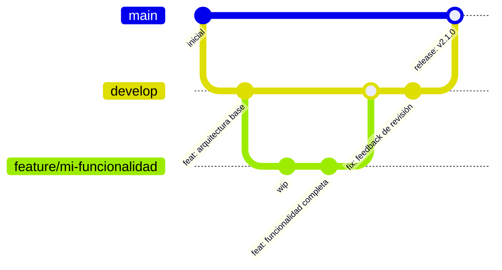

# Guía de Desarrollo — ShieldScan v2.0

## 1. Prerrequisitos

| Herramienta | Versión mínima | Propósito |
|-------------|---------------|---------|
| Docker Desktop | 4.x | Ejecutar todos los servicios localmente |
| Docker Compose | v2 (`docker compose`) | Orquestar el entorno local |
| Git | 2.x | Control de versiones |
| Python | 3.11 | Ejecutar tests y hooks pre-commit localmente |
| Node.js | 18+ | Desarrollo frontend (opcional) |

---

## 2. Configuración Inicial

### 2.1 Clonar el repositorio

```bash
git clone https://github.com/miguel-devsec/ShieldScan.git
cd ShieldScan
```

### 2.2 Configurar variables de entorno

```bash
cp env.example .env
```

Editar `.env` y establecer como mínimo:

```env
DB_PASSWORD=una_contraseña_segura_local
SECRET_KEY="<example_value_place_holder>"
```

Para desarrollo local los valores por defecto funcionan, pero nunca los uses en producción.

### 2.3 Instalar hooks pre-commit

Los hooks pre-commit ejecutan verificaciones de seguridad automáticamente antes de cada `git commit`. Instálalos una sola vez:

```bash
python -m pip install pre-commit
python -m pre_commit install
```

Después de esto, cada `git commit` ejecutará automáticamente Gitleaks (detección de secretos), Bandit (SAST Python) y verificaciones de higiene. Si algún hook falla, el commit queda bloqueado hasta que corrijas el problema.

Para ejecutar los hooks manualmente en todos los archivos en cualquier momento:

```bash
python -m pre_commit run --all-files
```

---

## 3. Ejecutar Servicios en Modo Desarrollo

### 3.1 Iniciar todos los servicios

```bash
docker compose up --build
```

Esto construye las imágenes desde el código fuente e inicia los 5 servicios. Espera a que pasen todos los health checks (aproximadamente 30 segundos en la primera ejecución).

| Servicio | URL | Notas |
|---------|-----|-------|
| Frontend | http://localhost:3000 | React SPA vía nginx |
| API + Swagger | http://localhost:8000/docs | Documentación API interactiva |
| Health del API | http://localhost:8000/health | Retorna `{"status":"ok"}` |
| Métricas del API | http://localhost:8000/metrics | Endpoint de scraping de Prometheus |

### 3.2 Iniciar solo los servicios backend (para desarrollo frontend)

```bash
docker compose up db redis api worker
```

Luego ejecutar el frontend localmente:

```bash
cd servicios/frontend
npm install
npm run dev      # Inicia el servidor Vite en el puerto 5173
```

### 3.3 Reconstruir un solo servicio tras cambios en el código

```bash
docker compose up --build api        # Reconstruir solo el API
docker compose restart worker        # Reiniciar worker (si el código no cambió)
```

### 3.4 Ver logs

```bash
docker compose logs -f api           # Seguir logs del API
docker compose logs -f worker        # Seguir logs del worker
docker compose logs -f               # Seguir todos los servicios
```

### 3.5 Detener todos los servicios

```bash
docker compose down                  # Detener y eliminar contenedores
docker compose down -v               # También eliminar volúmenes (reinicia la BD)
```

---

## 4. Estructura del Proyecto

```
servicios/
├── api/
│   ├── app/
│   │   ├── main.py          # App FastAPI, middleware, registro de routers
│   │   ├── database.py      # Motor SQLAlchemy y fábrica de sesiones
│   │   ├── models.py        # Modelos ORM: User, Audit
│   │   ├── schemas.py       # Esquemas Pydantic de petición/respuesta
│   │   ├── auth.py          # Creación/validación JWT, hash de contraseñas
│   │   └── routers/
│   │       ├── auth.py      # /auth/register, /auth/login, /auth/me
│   │       └── audits.py    # CRUD /audits/ + endpoint admin
│   ├── tests/
│   │   └── test_api.py      # Tests unitarios con Pytest
│   ├── requirements.txt
│   └── Dockerfile
│
├── worker/
│   ├── app/
│   │   ├── worker.py        # Instancia Celery + configuración
│   │   ├── tasks.py         # Tarea Celery perform_audit
│   │   ├── auditor.py       # Clase SecurityAuditor (todas las verificaciones)
│   │   └── database.py      # Sesión SQLAlchemy para el worker
│   ├── requirements.txt
│   └── Dockerfile
│
└── frontend/
    ├── src/
    │   ├── App.jsx           # Configuración React Router
    │   ├── pages/            # Login, Register, Dashboard, AuditDetail
    │   └── components/       # Componentes UI compartidos
    ├── public/
    ├── nginx.conf            # Configuración nginx con proxy API
    ├── package.json
    └── Dockerfile
```

---

## 5. Ejecutar Tests

### 5.1 Tests unitarios (Pytest)

```bash
cd servicios/api
pip install -r requirements.txt pytest pytest-cov httpx
pytest tests/ -v --tb=short --cov=app --cov-report=term-missing
```

El conjunto de tests usa `TestClient` de las utilidades de test de FastAPI con una base de datos SQLite en memoria — no se requieren servicios Docker en ejecución.

### 5.2 Ejecutar tests dentro de Docker (igual que en CI)

```bash
docker compose run --rm api pytest tests/ -v
```

### 5.3 Ver la cobertura de tests

Después de ejecutar con `--cov`, se imprime un resumen en el terminal. Para un informe HTML:

```bash
pytest tests/ --cov=app --cov-report=html
# Abrir htmlcov/index.html en el navegador
```

### 5.4 Pruebas manuales del API

Con los servicios en ejecución, usa la Swagger UI en http://localhost:8000/docs:

1. `POST /auth/register` — crear un usuario de prueba
2. `POST /auth/login` — obtener un token JWT
3. Hacer clic en **Authorize** y pegar el token
4. `POST /audits/` — enviar una URL para auditar
5. `GET /audits/{id}` — sondear hasta que el estado sea `completed`

---

## 6. Verificaciones de Seguridad Locales

### Hooks pre-commit (se ejecutan automáticamente al hacer commit)

```bash
python -m pre_commit run --all-files   # Ejecutar todos los hooks manualmente
python -m pre_commit run gitleaks      # Solo Gitleaks
python -m pre_commit run bandit        # Solo Bandit
```

### Trivy (escaneo de dependencias)

```bash
trivy fs servicios/api --severity HIGH,CRITICAL
trivy fs servicios/worker --severity HIGH,CRITICAL
```

### Bandit (Python SAST)

```bash
bandit -r servicios/api/app servicios/worker/app --severity-level medium
```

---

## 7. Contribución — Estrategia de Ramas



| Rama | Propósito | Reglas |
|------|-----------|--------|
| `main` | Código listo para producción | Protegida; requiere PR + pipeline exitoso |
| `develop` | Rama de integración | Requiere PR desde ramas feature |
| `feature/*` | Nuevas funcionalidades | Ramificar desde `develop`; fusionar de vuelta a `develop` |
| `fix/*` | Correcciones de bugs | Ramificar desde `develop` o `main` para hotfixes |

### Flujo de trabajo con ramas

```bash
git checkout develop
git pull origin develop
git checkout -b feature/mi-funcionalidad

# ... realizar cambios ...

git add servicios/api/app/nuevo_archivo.py
git commit -m "feat: agregar nueva verificación de seguridad para X"
git push origin feature/mi-funcionalidad
# Luego abrir un Pull Request en GitHub → develop
```

---

## 8. Convenciones de Commits

Seguir la especificación [Conventional Commits](https://www.conventionalcommits.org/):

```
<tipo>: <descripción corta>

[cuerpo opcional]
```

| Tipo | Cuándo usarlo |
|------|--------------|
| `feat` | Nueva funcionalidad |
| `fix` | Corrección de bug |
| `docs` | Solo documentación |
| `refactor` | Cambio de código que ni corrige un bug ni añade funcionalidad |
| `test` | Agregar o corregir tests |
| `chore` | Proceso de build, dependencias, configuración CI |
| `security` | Cambio relacionado con seguridad (preferido sobre `fix` para remediación de CVE) |

**Ejemplos:**

```bash
git commit -m "feat: agregar verificación de expiración de certificado SSL al auditor"
git commit -m "fix: manejar timeout cuando el sitio objetivo no responde"
git commit -m "security: reemplazar passlib por bcrypt directo (mitigación CVE)"
git commit -m "docs: agregar diagrama de secuencia para flujo de autenticación"
```

---

## 9. Proceso de Revisión de Código

1. Abrir un Pull Request desde tu rama hacia `develop`
2. El pipeline DevSecOps se ejecuta automáticamente en el PR (Gitleaks, SAST, SCA, build, tests)
3. Todos los jobs del pipeline deben pasar antes de permitir el merge
4. Al menos un revisor debe aprobar
5. Se prefiere squash and merge para mantener el historial de `develop` limpio

### Qué verifican los revisores

- ¿Introduce el código nuevos secretos o credenciales hardcodeadas?
- ¿Los nuevos endpoints del API están protegidos con autenticación adecuada?
- ¿Las entradas del usuario son validadas con Pydantic antes de llegar a la lógica de negocio?
- ¿Las consultas SQL pasan por el ORM (sin interpolación de cadenas)?
- ¿Los nuevos endpoints tienen tests correspondientes?

---

## 10. Agregar una Nueva Verificación de Seguridad

La lógica de auditoría reside en [servicios/worker/app/auditor.py](../servicios/worker/app/auditor.py). Para agregar una nueva verificación:

1. Agregar un nuevo método `_verificar_mi_funcionalidad(self) -> dict` a `SecurityAuditor`
2. Llamarlo dentro de `run()` y fusionar el resultado en el dict de salida
3. Actualizar el renderizador de resultados del frontend en `src/pages/AuditDetail.jsx` para mostrar el nuevo campo
4. Agregar un test en `servicios/api/tests/test_api.py` (mockear el worker; testear la forma de la respuesta del API)
