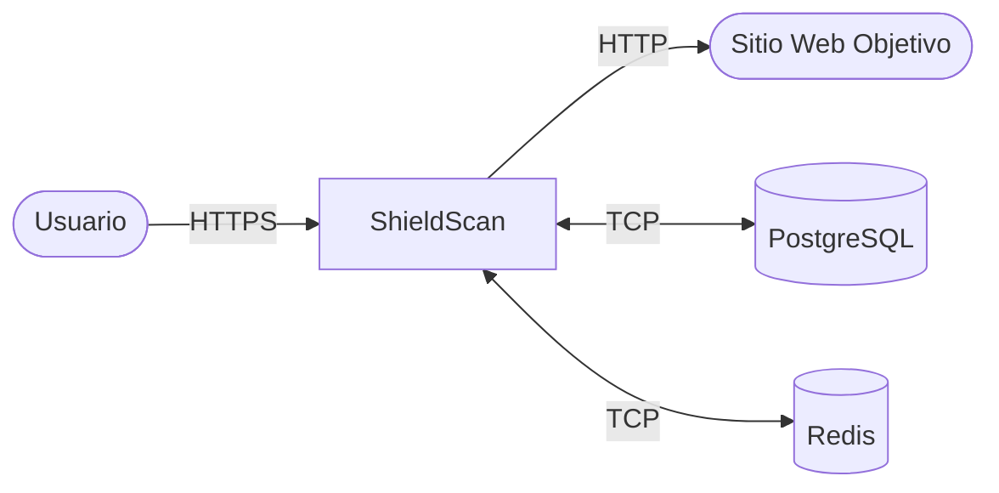
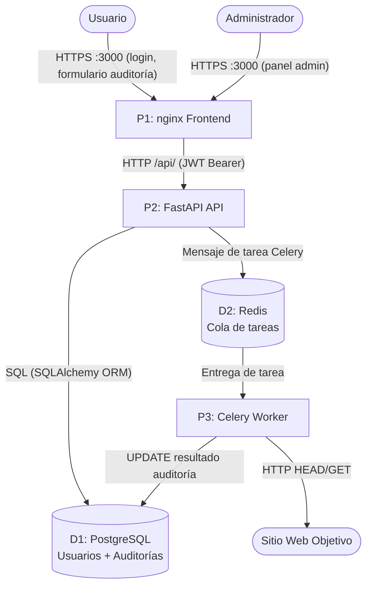
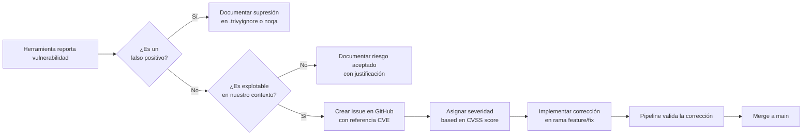

# Manual de Seguridad — ShieldScan v2.0

## 1. Modelo de Amenazas

### 1.1 Metodología

ShieldScan utiliza el framework de modelado de amenazas **STRIDE** aplicado a un Diagrama de Flujo de Datos (DFD). STRIDE categoriza las amenazas por tipo:

| Letra | Amenaza | Propiedad violada |
|-------|---------|------------------|
| **S** | Spoofing (Suplantación) | Autenticación |
| **T** | Tampering (Manipulación) | Integridad |
| **R** | Repudiation (Repudio) | No repudio |
| **I** | Information Disclosure (Divulgación) | Confidencialidad |
| **D** | Denial of Service (Denegación de servicio) | Disponibilidad |
| **E** | Elevation of Privilege (Escalada de privilegios) | Autorización |

Herramienta: OWASP Threat Dragon | Diagrama completo: [threat-model.md](threat-model.md)

### 1.2 Diagrama de Flujo de Datos — Nivel 0



### 1.3 Diagrama de Flujo de Datos — Nivel 1



### 1.4 Análisis STRIDE

| Amenaza | Componente | Descripción | Mitigación |
|---------|-----------|-------------|-----------|
| **S** — Suplantación | API `/auth/login` | Atacante se hace pasar por usuario válido | Hash bcrypt de contraseñas; JWT con expiración; sin enumeración de usuarios en mensajes de error |
| **S** — Suplantación | Validación JWT | Atacante falsifica un token JWT | Tokens firmados con `HS256` + `SECRET_KEY` fuerte; expiración validada en cada solicitud |
| **T** — Manipulación | Resultados de auditoría (BD) | Atacante modifica resultados almacenados | Resultados escritos solo por el worker vía SQL parametrizado; sin campos de auditoría modificables por el usuario |
| **T** — Manipulación | Cola de tareas Redis | Atacante inyecta tareas maliciosas | Redis no expuesto fuera de la red Docker; sin ruta de acceso externo |
| **R** — Repudio | Acciones de auditoría | Usuario niega haber lanzado una auditoría | Clave foránea `user_id` almacenada con cada auditoría; timestamp `created_at` inmutable |
| **I** — Divulgación | PostgreSQL | Credenciales BD filtradas vía logs o errores | BD no expuesta al host; credenciales vía env vars únicamente |
| **I** — Divulgación | Payload JWT | Datos sensibles en el token | El payload JWT contiene solo `user_id` y `role`; sin PII ni contraseñas |
| **I** — Divulgación | Mensajes de error del API | Trazas de pila expuestas al cliente | Los manejadores de excepciones de FastAPI retornan mensajes genéricos; modo debug desactivado en producción |
| **D** — DoS | Worker | Avalancha de solicitudes de auditoría agota los recursos del worker | Rate limiting de Celery configurable; límites de pool de conexiones BD |
| **D** — DoS | Sitio objetivo | ShieldScan usado como amplificador DoS contra objetivos | El auditor envía solo solicitudes HEAD/GET; sin inundación; `timeout=10s` por solicitud |
| **E** — Escalada | Endpoints admin | Usuario regular accede a `/audits/admin/all` | Dependencia `require_admin` de FastAPI verifica el claim `role` del JWT en cada solicitud |
| **E** — Escalada | Escape de contenedor | Contenedor comprometido gana acceso al host | Todos los contenedores corren como no-root; imágenes base mínimas; sin modo privilegiado (excepto Falco) |

---

## 2. Controles de Seguridad Implementados

### 2.1 Autenticación y Autorización

| Control | Implementación | Archivo |
|---------|---------------|---------|
| Hash de contraseñas | `bcrypt.hashpw()` con sal aleatoria | `servicios/api/app/auth.py` |
| Tokens JWT | `python-jose`, HS256, expiración 24h | `servicios/api/app/auth.py` |
| Aplicación de roles | Dependencia `require_admin` de FastAPI | `servicios/api/app/auth.py` |
| Validación de tokens | Cada endpoint protegido vía `get_current_user` | `servicios/api/app/auth.py` |

### 2.2 Seguridad de Contenedores

| Control | Implementación |
|---------|---------------|
| Usuario no-root | Todos los Dockerfiles: `RUN useradd -m appuser && USER appuser` |
| Imágenes base mínimas | `python:3.11-slim`, `node:18-alpine`, `nginx:alpine` |
| Sin secretos en imágenes | Todos los secretos vía variables de entorno |
| Health checks | Todos los servicios definen `HEALTHCHECK` |
| Aislamiento de red | PostgreSQL y Redis en red Docker interna únicamente |

### 2.3 Validación de Entradas

- Todos los cuerpos de solicitud del API validados con esquemas **Pydantic** antes de llegar a la lógica de negocio
- Normalización de URL: prefijo `http://` o `https://` forzado antes de auditar
- Inyección SQL prevenida: todas las consultas pasan por el **ORM SQLAlchemy** con sentencias parametrizadas

### 2.4 CORS

El middleware CORS de FastAPI está configurado. En producción, `allow_origins=["*"]` debería reemplazarse por el origen específico del frontend.

---

## 3. Herramientas de Seguridad en el Pipeline

### 3.1 Gitleaks — Detección de Secretos

**Qué hace:** Escanea todo el historial de git en busca de secretos, claves API, contraseñas y tokens que fueron comprometidos accidentalmente.

**Dónde se ejecuta:**
- GitHub Actions: job `secrets-scan` en cada push
- Localmente: hook pre-commit en cada `git commit`

**Configuración:** Usa las reglas por defecto de Gitleaks (más de 150 patrones regex cubriendo claves AWS, secretos JWT, tokens Docker, etc.)

**Interpretación de resultados:**

```
Finding:     Secret
RuleID:      generic-api-key
File:        servicios/api/app/config.py
Line:        12
Commit:      abc1234
```

Si Gitleaks reporta un hallazgo:
1. **No hacer push** del commit
2. Revocar el secreto expuesto inmediatamente (rotar claves, cambiar contraseñas)
3. Eliminar el secreto del archivo — usar una variable de entorno en su lugar
4. Usar `git filter-repo` para purgar el secreto del historial si ya fue commiteado
5. Hacer force-push del historial limpio

### 3.2 Bandit — Python SAST

**Qué hace:** Análisis estático del código fuente Python buscando vulnerabilidades de seguridad comunes.

**Dónde se ejecuta:**
- GitHub Actions: job `sast` — falla en severidad HIGH
- Localmente: hook pre-commit en cada `git commit`

**Niveles de severidad:** LOW, MEDIUM, HIGH
**Niveles de confianza:** LOW, MEDIUM, HIGH

El pipeline está configurado para fallar con `--severity-level medium --confidence-level medium`.

**Hallazgos comunes y cómo manejarlos:**

| ID del problema | Hallazgo | Acción |
|----------------|---------|--------|
| B105 | Contraseña hardcodeada | Mover a variable de entorno |
| B106 | Contraseña en llamada a función | Revisar y refactorizar |
| B301 | Uso de Pickle | Evitar pickle; usar JSON |
| B501 | Versión SSL/TLS débil | Forzar TLS 1.2+ |
| B601 | Inyección de shell | Usar `subprocess` con argumentos en lista |

**Suprimir un falso positivo** (solo cuando esté justificado):

```python
result = subprocess.run(cmd, shell=True)  # noqa: B602 — cmd es constante interna
```

Documentar la razón de la supresión en un comentario de código.

### 3.3 Semgrep — SAST Avanzado

**Qué hace:** Análisis estático basado en patrones usando conjuntos de reglas `p/python`, `p/security-audit` y `p/owasp-top-ten`.

**Dónde se ejecuta:** GitHub Actions: job `sast`

**Interpretación de salida SARIF:** Los resultados se suben automáticamente a GitHub Security → Code Scanning Alerts vía el pipeline.

**Conjuntos de reglas aplicados:**
- `p/python` — Patrones de seguridad específicos de Python
- `p/security-audit` — Anti-patrones de seguridad generales
- `p/owasp-top-ten` — Patrones de vulnerabilidades del OWASP Top 10

### 3.4 Trivy — SCA y Escaneo de Imágenes

**Dos modos de escaneo:**

| Modo | Job | Qué escanea |
|------|-----|------------|
| `fs` (filesystem) | `sca` | `requirements.txt`, `package.json` — dependencias vulnerables |
| `image` | `build-and-scan` | Imágenes Docker construidas — paquetes OS + libs de lenguaje |

**Comportamiento del escaneo de imágenes:** El pipeline **falla con código de salida 1** si se encuentra algún CVE de severidad `CRITICAL` en una imagen Docker. Esta es una puerta de seguridad estricta.

**Interpretación de un informe Trivy:**

```
┌──────────────┬────────────────┬──────────┬──────────────────────┐
│   Librería   │ Vulnerabilidad │ Severidad│ Versión Corregida    │
├──────────────┼────────────────┼──────────┼──────────────────────┤
│ openssl      │ CVE-2024-XXXX  │ CRITICAL │ 3.0.14               │
└──────────────┴────────────────┴──────────┴──────────────────────┘
```

**Opciones de remediación:**
1. **Actualizar la dependencia**: Cambiar la versión en `requirements.txt` o actualizar la imagen base
2. **Documentar y aceptar** (para CVEs no explotables): Añadir a `.trivyignore` con justificación documentada

```
# .trivyignore — solo para CVEs confirmados como no explotables
# CVE-2024-XXXX: solo explotable cuando se usa la función X; nosotros no la usamos
CVE-2024-XXXX
```

### 3.5 OWASP ZAP — Pruebas de Seguridad Dinámicas (DAST)

**Qué hace:** Sondea activamente la aplicación en ejecución para encontrar vulnerabilidades como XSS, inyección SQL, CSRF, mala configuración de seguridad.

**Cuándo se ejecuta:** Solo en pushes a `main` (después de que las imágenes se publican en Docker Hub y se levanta un entorno de staging).

**Objetivos del escaneo:**
- `http://localhost:8000` — FastAPI API
- `http://localhost:3000` — Frontend React

**Tipo de escaneo:** Escaneo baseline (pasivo + activo limitado) — seguro para ejecutar contra staging.

**Interpretación de resultados ZAP:**

| Riesgo | Descripción | Acción |
|--------|-------------|--------|
| Alto | Explotable activamente | Corregir antes del release |
| Medio | Explotable bajo ciertas condiciones | Corregir dentro del sprint |
| Bajo | Mejora de defensa en profundidad | Corregir cuando sea conveniente |
| Informativo | Recomendación de mejores prácticas | Revisar y decidir |

**Configuración de reglas ZAP:** `.github/zap-rules.tsv` — las reglas pueden configurarse como WARN, FAIL o IGNORE.

### 3.6 Checkov — Escaneo de Seguridad IaC

**Qué hace:** Escanea Dockerfiles, docker-compose.yml y configuración de Swarm en busca de malas configuraciones de seguridad en infraestructura.

**Dónde se ejecuta:** GitHub Actions: job `iac-scan`

**Verificaciones clave realizadas:**
- Contenedor ejecutándose como usuario root
- Contenedores privilegiados
- Secretos hardcodeados en variables de entorno
- Health checks faltantes
- Puertos sensibles expuestos

**Resultados subidos a:** GitHub Security → Code Scanning Alerts (formato SARIF)

---

## 4. Proceso de Gestión de Vulnerabilidades

### 4.1 Clasificación de severidad

| Severidad | Tiempo de respuesta | Acción |
|-----------|-------------------|--------|
| CRÍTICA | 24 horas | Bloquear release; parche de emergencia |
| ALTA | 1 semana | Corregir en el próximo sprint |
| MEDIA | 1 mes | Programar para el backlog |
| BAJA | Próximo trimestre | Documentar y revisar |

### 4.2 Ciclo de vida de una vulnerabilidad



### 4.3 Corregir una dependencia vulnerable

```bash
# 1. Identificar el paquete vulnerable
trivy fs servicios/api --severity CRITICAL

# 2. Verificar si existe una versión corregida
pip index versions paquete-vulnerable

# 3. Actualizar requirements.txt
# Cambiar: paquete-vulnerable==1.0.0
# A:       paquete-vulnerable==1.0.1

# 4. Probar localmente
docker compose up --build api

# 5. Commit con mensaje claro
git commit -m "security: actualizar paquete-vulnerable a 1.0.1 (CVE-2024-XXXX)"
```

---

## 5. Política de Divulgación Responsable

Si descubres una vulnerabilidad de seguridad en ShieldScan:

1. **No abras un issue público en GitHub** — esto expone la vulnerabilidad a atacantes antes de que haya una corrección disponible
2. **Envía un correo** al equipo de seguridad a: `security@arthurtech.example.com` (o usa el reporte privado de vulnerabilidades de GitHub)
3. Incluye:
   - Descripción de la vulnerabilidad
   - Pasos para reproducirla
   - Impacto potencial
   - Corrección sugerida (opcional)
4. **Tiempo de respuesta esperado**: 48 horas para el acuse de recibo, 14 días para una corrección

Seguimos una política de **divulgación coordinada de 90 días** — publicaremos los detalles después de lanzar una corrección o después de 90 días, lo que ocurra primero.

Acreditaremos a los investigadores que divulguen vulnerabilidades de forma responsable en nuestras notas de versión.

---

## 6. Lista de Verificación de Seguridad para Releases

Antes de hacer merge a `main`, verificar:

- [ ] Todos los jobs del pipeline pasan (Gitleaks, SAST, SCA, build-and-scan, unit-tests, iac-scan)
- [ ] Sin CVEs CRITICAL en el escaneo de imágenes Trivy
- [ ] Sin hallazgos HIGH de Bandit
- [ ] Gitleaks no reporta secretos en el rango de commits
- [ ] Escaneo DAST de ZAP completado (se ejecuta automáticamente en main)
- [ ] Sin credenciales hardcodeadas en el diff (`git diff main...HEAD`)
- [ ] Nuevas variables de entorno documentadas en `env.example`
- [ ] `.env` está listado en `.gitignore`
