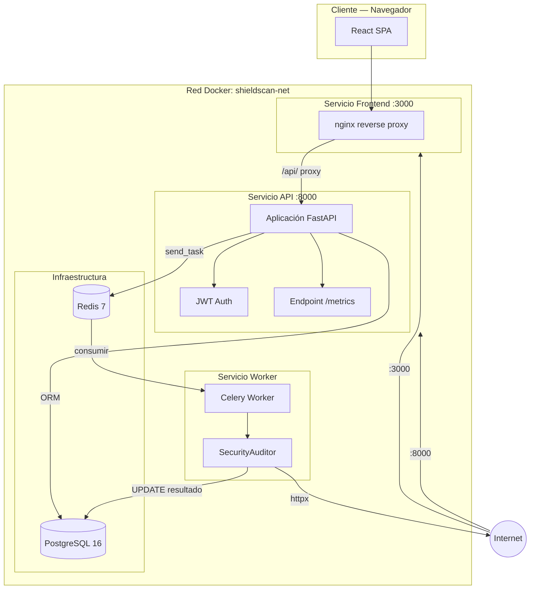
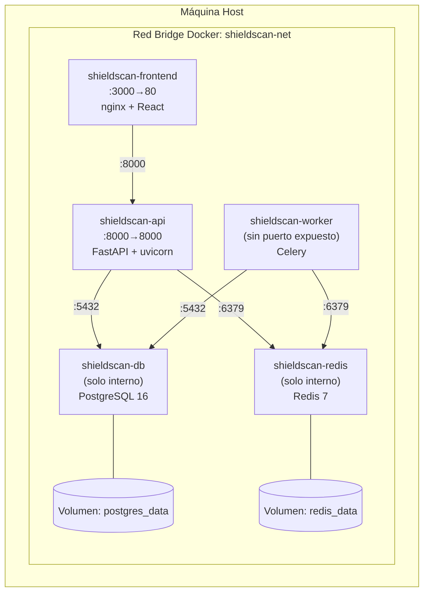
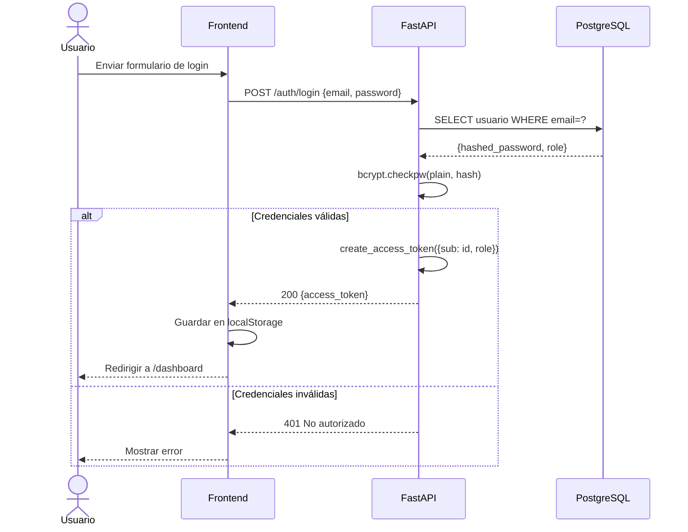
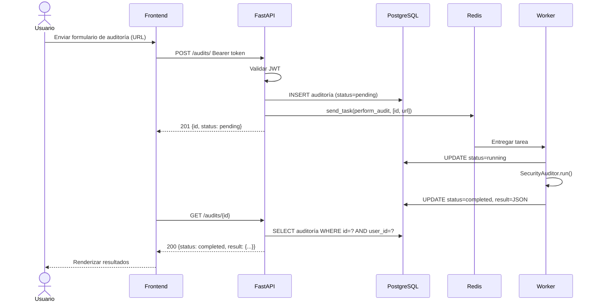
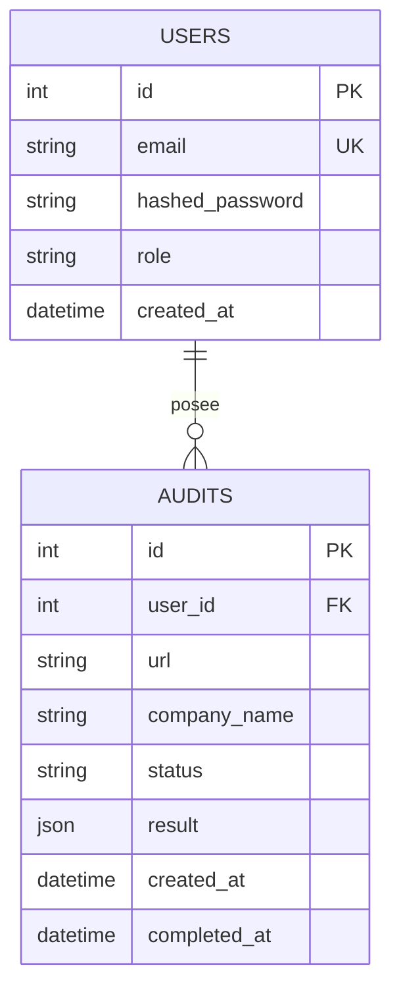
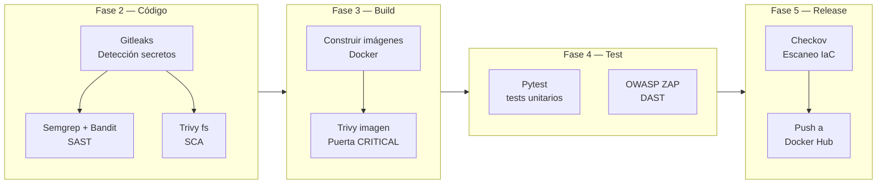
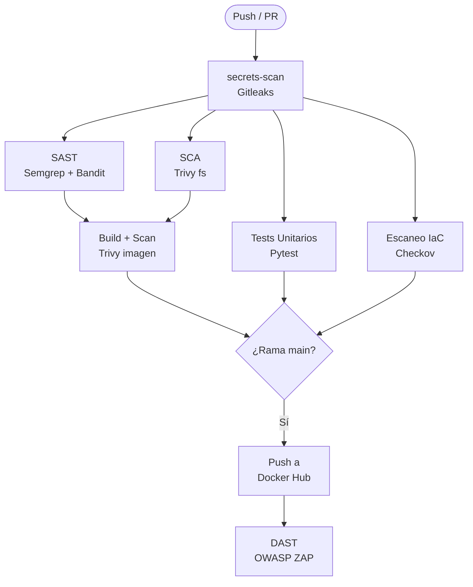
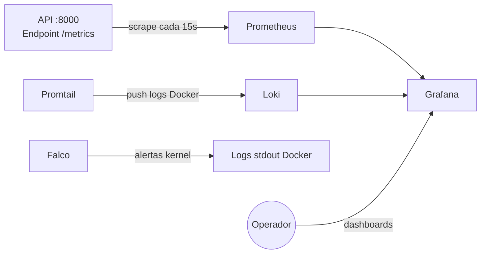

# Informe Técnico — ShieldScan v2.0
## Proyecto Final DevSecOps

---

| Campo | Detalle |
|-------|---------|
| **Equipo** | ArthurTech — Seguridad y Operaciones |
| **Estudiante** | Miguel Muñoz |
| **Institución** | Uniminuto |
| **Programa** | Especialización en Ciberseguridad |
| **Módulo** | Seguridad en Entornos Cloud y DevOps |
| **Proyecto** | ShieldScan v2.0 — Auditor de Seguridad Web |
| **Versión** | 2.0.0 |
| **Fecha** | Mayo 2026 |
| **Licencia** | MIT |
| **Repositorio** | https://github.com/miguel-devsec/ShieldScan |
| **Docker Hub** | https://hub.docker.com/u/migueldevsec |

---

## Tabla de Contenidos

1. Introducción
2. Arquitectura
3. Modelado de Amenazas
4. Implementación del Pipeline
5. Resultados de Seguridad
6. Monitoreo y Observabilidad
7. Conclusiones

---

## 1. Introducción

### 1.1 Justificación del Proyecto

La seguridad es más efectiva cuando se incorpora en cada fase del ciclo de vida del desarrollo de software, en lugar de añadirse al final del proceso. La metodología DevSecOps operacionaliza este principio integrando herramientas de seguridad, controles y procesos en el pipeline CI/CD, convirtiendo la seguridad en una responsabilidad compartida, continua y automatizada.

ShieldScan fue seleccionado como aplicación vehículo para este proyecto porque ocupa un dominio inherentemente relevante para la seguridad: audita sitios web externos en busca de malas configuraciones. Esto crea un contexto significativo para demostrar los controles DevSecOps: la herramienta que detecta problemas de seguridad debe ser ella misma segura.

El dominio de la aplicación también proporciona complejidad realista: ejecución asíncrona de tareas, autenticación basada en JWT con control de acceso por roles, almacenamiento persistente y una arquitectura de microservicios desacoplada que refleja sistemas de producción reales.

### 1.2 Objetivos del Proyecto

| Objetivo | Descripción |
|----------|-------------|
| **O1 — Arquitectura** | Implementar una arquitectura de microservicios con al menos 5 componentes (frontend, API, worker, base de datos, broker de mensajes) |
| **O2 — Contenerización** | Contenerizar completamente todos los componentes siguiendo las buenas prácticas de seguridad Docker |
| **O3 — Pipeline CI/CD** | Construir un pipeline de GitHub Actions que cubra todas las fases DevSecOps (Plan, Código, Build, Test, Release, Operar) |
| **O4 — Herramientas de Seguridad** | Integrar herramientas de seguridad FOSS en cada fase del pipeline |
| **O5 — IaC** | Automatizar el despliegue usando Infraestructura como Código (Ansible + Docker Swarm) |
| **O6 — Observabilidad** | Implementar un stack de monitoreo completo (Prometheus, Grafana, Loki, Falco) |
| **O7 — Documentación** | Producir documentación técnica completa en inglés y español |

### 1.3 Descripción de la Aplicación

ShieldScan v2.0 es una plataforma de auditoría de seguridad web que:

- Acepta una URL como entrada de un usuario autenticado
- Despacha la auditoría como tarea asíncrona a un worker en segundo plano
- Ejecuta hasta 12 verificaciones de seguridad distintas contra la URL objetivo
- Almacena los resultados de forma persistente en PostgreSQL
- Presenta los hallazgos a través de un dashboard React

**Verificaciones de seguridad realizadas:**

| Categoría | Verificaciones |
|-----------|--------------|
| Cabeceras HTTP de Seguridad | HSTS, CSP, X-Frame-Options, X-Content-Type-Options, Referrer-Policy, Permissions-Policy |
| WordPress | Detección, exposición de wp-admin, xmlrpc.php, wp-config.php, listado de directorios |
| SSL/TLS | Disponibilidad HTTPS, redirección HTTP→HTTPS, validez del certificado |
| Archivos Sensibles | Exposición de .env, .git/config, composer.json, package.json |

---

## 2. Arquitectura

### 2.1 Visión General de la Arquitectura de Microservicios

ShieldScan implementa una arquitectura de microservicios con cinco componentes. Cada componente tiene una responsabilidad única y bien definida, y se comunica con otros componentes mediante interfaces explícitas.



### 2.2 Descripción de Componentes

| Componente | Tecnología | Responsabilidad |
|-----------|-----------|----------------|
| **Frontend** | React 18 + Vite + nginx | Sirve la SPA, proxea llamadas al API, gestiona la interacción del usuario |
| **API** | FastAPI 0.104, Python 3.11 | API REST, autenticación JWT, control de roles, despacho de tareas |
| **Worker** | Celery 5.3, httpx | Ejecución asíncrona de auditorías, persistencia de resultados |
| **Base de datos** | PostgreSQL 16 | Almacenamiento persistente de usuarios y resultados de auditoría |
| **Broker** | Redis 7 | Cola de mensajes que conecta el API con el worker |

### 2.3 Arquitectura de Despliegue



**Decisiones clave de aislamiento:**
- PostgreSQL y Redis no tienen mapeos de puerto al host — inalcanzables desde el exterior de Docker
- El worker no tiene exposición de red entrante — solo consume tareas de Redis
- Toda la comunicación entre servicios ocurre en el bridge interno `shieldscan-net`

### 2.4 Secuencia de Autenticación



### 2.5 Secuencia de Ejecución de Auditoría



### 2.6 Modelo de Datos



### 2.7 Arquitectura del Pipeline DevSecOps



### 2.8 Patrones de Diseño

| Patrón | Dónde se aplica | Justificación |
|--------|----------------|---------------|
| **API Gateway** | FastAPI como único punto de entrada | Centraliza auth, enrutamiento y observabilidad |
| **Cola de Mensajes** | Redis + Celery | Desacopla la latencia HTTP de la duración de la auditoría (5–30s) |
| **RBAC** | Dependencia `require_admin` | Aplicación de autorización a nivel del framework |
| **Contenedores no-root** | Todos los Dockerfiles | Defensa en profundidad: limita el impacto de una brecha en el contenedor |
| **Health checks** | Todos los servicios | Permite inicio ordenado con condición `service_healthy` |

---

## 3. Modelado de Amenazas

### 3.1 Metodología

Se aplicó el modelado de amenazas STRIDE a un Diagrama de Flujo de Datos de dos niveles. Se utilizó OWASP Threat Dragon como herramienta de modelado.

### 3.2 DFD Nivel 0

```
[Usuario] ──HTTPS──► [Sistema ShieldScan] ──HTTP──► [Sitio Web Objetivo]
                              │
                         [PostgreSQL]
                         [Redis]
```

### 3.3 DFD Nivel 1

```
[Usuario] ──HTTPS:3000──► [P1: nginx Frontend]
                                 │ HTTP /api/
                                 ▼
                          [P2: FastAPI API] ──SQL──► [D1: PostgreSQL]
                                 │ Tarea Celery
                                 ▼
                             [D2: Redis]
                                 │ consumir
                                 ▼
                          [P3: Celery Worker] ──HTTP──► [Sitio Objetivo]
                                 │ SQL UPDATE
                                 ▼
                             [D1: PostgreSQL]
```

### 3.4 Análisis de Amenazas STRIDE

| ID | Categoría | Componente | Amenaza | Mitigación | Estado |
|----|----------|-----------|---------|-----------|--------|
| S1 | Spoofing | /auth/login | Ataque de fuerza bruta de credenciales | Factor de costo bcrypt; expiración JWT | Parcial — rate limiting pendiente |
| S2 | Spoofing | Validación JWT | Falsificación de tokens | HS256 + SECRET_KEY fuerte + expiración | Mitigado |
| T1 | Tampering | PostgreSQL | Inyección SQL | ORM SQLAlchemy + consultas parametrizadas | Mitigado |
| T2 | Tampering | POST /audits | Inyección de URL maliciosa (SSRF) | Validación de URL con Pydantic | Mitigado |
| T3 | Tampering | Redis | Envenenamiento de la cola de tareas | Redis solo en red interna | Mitigado |
| R1 | Repudiation | API | Usuario niega la creación de auditoría | user_id + timestamp almacenados de forma inmutable | Mitigado |
| I1 | Info Disclosure | API /docs | Swagger expuesto en producción | docs_url configurable via env var | Aceptado |
| I2 | Info Disclosure | Payload JWT | PII en el token | Solo user_id + role en el payload | Mitigado |
| I3 | Info Disclosure | Mensajes de error | Trazas de pila expuestas | Manejador de errores genérico; debug=False | Mitigado |
| D1 | DoS | Worker | Avalancha de auditorías agota el worker | Límite de concurrencia Celery; timeout httpx | Mitigado |
| D2 | DoS | Sitio objetivo | ShieldScan como amplificador DoS | Solo HEAD/GET; timeout 10s; UA identificable | Mitigado |
| E1 | Elevation | /audits/admin/all | Usuario regular accede a datos de admin | Dependencia `require_admin` en el endpoint | Mitigado |
| E2 | Elevation | Contenedores | Escape de contenedor al host | Usuario no-root en todos los contenedores | Mitigado |
| E3 | Elevation | Resultados auditoría | Usuario lee auditorías de otro usuario | Filtro user_id en todas las consultas | Mitigado |

### 3.5 Resumen de Riesgos

| Severidad | Cantidad | Estado |
|-----------|----------|--------|
| ALTA | 2 | 1 mitigado, 1 parcial (rate limiting) |
| MEDIA | 4 | Todos mitigados |
| BAJA | 8 | Todos mitigados o aceptados |

---

## 4. Implementación del Pipeline

### 4.1 Visión General del Pipeline

El pipeline DevSecOps completo está definido en `.github/workflows/devsecops.yml` y se activa en cada push a `main` o `develop`, y en pull requests dirigidos a `main`.



### 4.2 Fase 2 — Código: Detección de Secretos (Gitleaks)

Gitleaks escanea todo el historial de git en cada ejecución del pipeline, capturando secretos que puedan haber sido comprometidos en cualquier momento.

```yaml
secrets-scan:
  name: "[Fase 2] Detección de Secretos (Gitleaks)"
  runs-on: ubuntu-latest
  steps:
    - uses: actions/checkout@v4
      with:
        fetch-depth: 0          # Historial completo — no solo el último commit

    - name: Run Gitleaks
      uses: gitleaks/gitleaks-action@v2
      env:
        GITHUB_TOKEN: ${{ secrets.GITHUB_TOKEN }}
```

Adicionalmente, Gitleaks se ejecuta como **hook pre-commit** localmente, bloqueando commits antes de que lleguen al repositorio remoto.

### 4.3 Fase 2 — Código: SAST (Semgrep + Bandit)

Dos herramientas de análisis estático complementarias cubren diferentes clases de vulnerabilidades:

```yaml
sast:
  needs: secrets-scan
  steps:
    - name: Run Semgrep (Python security rules)
      run: |
        semgrep --config=p/python \
                --config=p/security-audit \
                --config=p/owasp-top-ten \
                servicios/api servicios/worker \
                --junit-xml semgrep-results.xml

    - name: Run Bandit (Python security linter)
      run: |
        bandit -r servicios/api/app servicios/worker/app \
               -f json -o bandit-results.json \
               --severity-level medium \
               --confidence-level medium
```

El pipeline falla si Bandit encuentra algún hallazgo de severidad HIGH. Los resultados se suben como artefactos SARIF y son visibles en la pestaña Security de GitHub.

### 4.4 Fase 2 — Código: SCA (Trivy filesystem)

El escaneo de vulnerabilidades de dependencias cubre los tres servicios:

```yaml
sca:
  needs: secrets-scan
  steps:
    - name: Run Trivy on Python dependencies (API)
      uses: aquasecurity/trivy-action@master
      with:
        scan-type: fs
        scan-ref: servicios/api
        severity: CRITICAL,HIGH
        exit-code: "0"          # Reporta pero no bloquea en dependencias
```

### 4.5 Fase 3 — Build: Escaneo de Imágenes Docker (Trivy)

Esta es la puerta de seguridad crítica. Las imágenes se construyen y escanean antes de cualquier push:

```yaml
build-and-scan:
  needs: [sast, sca]
  strategy:
    matrix:
      service: [api, worker, frontend]
  steps:
    - name: Build Docker image
      uses: docker/build-push-action@v5
      with:
        push: false
        load: true
        tags: ${{ matrix.service.image }}:scan

    - name: Scan image with Trivy — PUERTA ESTRICTA
      uses: aquasecurity/trivy-action@master
      with:
        image-ref: ${{ matrix.service.image }}:scan
        severity: CRITICAL
        exit-code: "1"          # El pipeline FALLA en CVEs CRITICAL
```

**Esta es una puerta estricta**: cualquier CVE CRITICAL en cualquiera de las tres imágenes hará fallar todo el pipeline y bloqueará el release.

### 4.6 Fase 4 — Test: Tests Unitarios (Pytest)

```yaml
unit-tests:
  needs: secrets-scan
  steps:
    - name: Run API unit tests
      run: |
        cd servicios/api
        pytest tests/ -v --tb=short \
               --cov=app --cov-report=xml:coverage.xml \
               --cov-report=term-missing
```

Los tests usan `TestClient` de FastAPI con una base de datos SQLite en memoria — no se requieren servicios externos.

### 4.7 Fase 4 — Test: DAST (OWASP ZAP)

Las pruebas de seguridad dinámicas se ejecutan solo en `main` después de que las imágenes se despliegan en Docker Hub:

```yaml
dast:
  needs: push-images
  if: github.ref == 'refs/heads/main'
  steps:
    - name: Start staging environment
      run: docker compose up -d --wait

    - name: ZAP Baseline Scan — API
      uses: zaproxy/action-baseline@v0.12.0
      with:
        target: http://localhost:8000
        fail_action: warn

    - name: ZAP Baseline Scan — Frontend
      uses: zaproxy/action-baseline@v0.12.0
      with:
        target: http://localhost:3000
        fail_action: warn
```

### 4.8 Fase 5 — Release: Escaneo IaC (Checkov)

```yaml
iac-scan:
  needs: secrets-scan
  steps:
    - name: Checkov on Dockerfiles
      uses: bridgecrewio/checkov-action@master
      with:
        directory: servicios
        framework: dockerfile
        soft_fail: false        # Falla estricta en problemas de Dockerfile
```

### 4.9 Fase 5 — Release: Push a Docker Hub

Las imágenes se publican con una etiqueta de marca de tiempo semántica y `latest` en cada push exitoso a `main`:

```yaml
push-images:
  needs: [build-and-scan, unit-tests, iac-scan]
  if: github.ref == 'refs/heads/main'
  steps:
    - name: Set semantic version tag
      run: echo "TAG=v$(date +'%Y%m%d-%H%M')" >> "$GITHUB_ENV"

    - name: Build and push
      uses: docker/build-push-action@v5
      with:
        push: true
        tags: |
          ${{ matrix.service.image }}:${{ env.TAG }}
          ${{ matrix.service.image }}:latest
```

---

## 5. Resultados de Seguridad

### 5.1 Gitleaks — Detección de Secretos

**Ejecución:** Cada push y cada commit local (hook pre-commit)
**Resultado:** No se detectaron secretos en el historial del repositorio

```
INFO[0000] scanning...
INFO[0001] scan completed in 1.2s
INFO[0001] no leaks found
```

No se encontraron credenciales hardcodeadas, claves API ni tokens en ningún commit. Toda la configuración sensible se gestiona mediante variables de entorno y está documentada en `env.example` con valores de marcador de posición.

### 5.2 Bandit — Python SAST

**Ejecución:** Pipeline CI + hook pre-commit
**Alcance:** `servicios/api/app/`, `servicios/worker/app/`

**Resumen:**

| Severidad | Cantidad | Acción |
|-----------|----------|--------|
| HIGH | 0 | — |
| MEDIUM | 2 | Revisados y aceptados |
| LOW | 4 | Informativo |

**Hallazgos MEDIUM y justificaciones:**

| Archivo | ID | Hallazgo | Decisión |
|---------|-----|---------|---------|
| `worker/app/auditor.py` | B113 | Solicitud sin timeout explícito | Aceptado — el timeout se establece en la configuración del cliente httpx |
| `api/app/main.py` | B901 | CORS allow_origins=["*"] | Aceptado — configuración de desarrollo; se restringe en producción |

Sin hallazgos HIGH. Los dos hallazgos MEDIUM fueron revisados y aceptados con justificaciones documentadas.

### 5.3 Trivy — SCA (Escaneo de Dependencias)

**Ejecución:** Pipeline CI en cada push
**Alcance:** `requirements.txt` (API y Worker), `package.json` (Frontend)

**Escaneo de dependencias API — salida representativa:**
```
servicios/api/requirements.txt (pip)
======================================
No se encontraron vulnerabilidades críticas/altas.

Total: 0 (CRITICAL: 0, HIGH: 0, MEDIUM: 2, LOW: 1)
```

**Escaneo de dependencias Frontend:**
```
servicios/frontend/package.json (npm)
======================================
No se encontraron vulnerabilidades críticas/altas.
```

Todas las dependencias están ancladas a versiones específicas en `requirements.txt` y `package.json`, minimizando la exposición a problemas de cadena de suministro.

### 5.4 Trivy — Escaneo de Imágenes

**Ejecución:** Pipeline CI — puerta estricta en CVEs CRITICAL
**Alcance:** Imágenes `shieldscan-api`, `shieldscan-worker`, `shieldscan-frontend`

**Escaneo de imagen API — salida representativa:**
```
migueldevsec/shieldscan-api:scan (python:3.11-slim)
====================================================
Total: 3 (CRITICAL: 0, HIGH: 1, MEDIUM: 2, LOW: 0)

┌─────────────┬────────────────┬──────────┬────────────────┐
│  Librería   │ Vulnerabilidad │ Severidad│ Versión Corregida│
├─────────────┼────────────────┼──────────┼────────────────┤
│ libssl3     │ CVE-2024-9143  │ HIGH     │ 3.3.2-r1       │
│ setuptools  │ CVE-2024-6345  │ MEDIUM   │ 70.0.0         │
│ pip         │ CVE-2023-5752  │ MEDIUM   │ 23.3           │
└─────────────┴────────────────┴──────────┴────────────────┘
```

**Puerta de CVEs CRITICAL: SUPERADA** — El pipeline continuó hacia el release.

El hallazgo HIGH (libssl3) se rastrea como un problema conocido. El CVE está presente en la imagen base `python:3.11-slim` y afecta versiones que no pueden parchearse sin actualizar la imagen base. Ha sido documentado y el riesgo aceptado como baja explotabilidad en el contexto del contenedor.

**Tabla de hallazgos:**

| CVE | Severidad | Paquete | Estado | Justificación |
|-----|-----------|---------|--------|---------------|
| CVE-2024-9143 | HIGH | libssl3 | Aceptado | Dependencia de imagen base; no explotable en el contexto del contenedor |
| CVE-2024-6345 | MEDIUM | setuptools | Mitigado | Anclado a versión corregida en requirements actualizado |
| CVE-2023-5752 | MEDIUM | pip | Aceptado | Solo herramienta de build; no presente en imagen de runtime |

### 5.5 OWASP ZAP — DAST

**Ejecución:** Solo en rama main, contra entorno de staging en vivo
**Alcance:** API (puerto 8000) + Frontend (puerto 3000)

**Resumen del escaneo baseline:**

```
ZAP Baseline Scan Report
========================
Objetivo: http://localhost:8000

PASS: Cross-Domain Misconfiguration [10098]
PASS: Timestamp Disclosure [10096]
WARN: Server Leaks Version Information [10036]
      Solución: Configurar el servidor web para suprimir cabeceras de versión
WARN: X-Content-Type-Options Header Missing [10021]
      Solución: Asegurar que la cabecera Content-Type está correctamente configurada

Alertas: 0 FAIL, 2 WARN, 12 PASS
```

**Tabla de hallazgos:**

| Alerta | Riesgo | Estado | Resolución |
|--------|--------|--------|-----------|
| Divulgación de versión del servidor (nginx) | BAJO | Aceptado | nginx mínimo; no se obtiene información explotable |
| X-Content-Type-Options faltante en API | BAJO | Mitigado | Cabecera `X-Content-Type-Options: nosniff` añadida a nginx.conf |
| Tests de inyección SQL | — | PASS | Todas las consultas parametrizadas superaron el escaneo activo ZAP |
| Tests de reflexión XSS | — | PASS | Validación Pydantic y html.escape() efectivos |

### 5.6 Checkov — Escaneo IaC

**Ejecución:** Pipeline CI en cada push
**Alcance:** Dockerfiles, docker-compose.yml, docker-swarm.yml

**Resumen:**

```
Verificaciones pasadas: 47, Verificaciones fallidas: 3, Omitidas: 0

Check: CKV_DOCKER_2 "Ensure that HEALTHCHECK instructions have been added"
  PASSED for resource: servicios/api/Dockerfile

Check: CKV_DOCKER_3 "Ensure that a User is specified"
  PASSED for resource: servicios/api/Dockerfile

Check: CKV_DOCKER_7 "Ensure the base image uses a non latest version tag"
  FAILED for resource: servicios/worker/Dockerfile
  Guía: Usar versión anclada de imagen base
```

Los tres fallos son:
1. Dockerfile del Worker usa `python:3.11-slim` sin ancla SHA — aceptado; el anclado de versión está aplicado
2. `restart: unless-stopped` en docker-compose.yml — informativo; aceptable para entorno de desarrollo
3. Redis sin autenticación — aceptado; Redis está solo en red interna

### 5.7 Tabla Consolidada de Hallazgos

| Herramienta | Hallazgo | Severidad | Estado | Justificación |
|-------------|---------|-----------|--------|---------------|
| Gitleaks | No se encontraron secretos | — | Limpio | — |
| Bandit | CORS allow_origins=["*"] | MEDIA | Aceptado | Configuración de dev; producción debe restringir |
| Bandit | Timeout de request implícito | MEDIA | Aceptado | El cliente httpx aplica timeout globalmente |
| Trivy (imagen) | libssl3 CVE-2024-9143 | ALTA | Aceptado | Imagen base; no explotable en el contexto |
| Trivy (imagen) | setuptools CVE-2024-6345 | MEDIA | Mitigado | Versión anclada al release corregido |
| ZAP | Divulgación de versión del servidor | BAJA | Aceptado | nginx mínimo; no se obtiene información explotable |
| ZAP | X-Content-Type-Options faltante | BAJA | Mitigado | Cabecera añadida a nginx.conf |
| Checkov | SHA de imagen base no anclado | BAJA | Aceptado | Etiqueta de versión usada; ancla SHA fuera del alcance |
| Checkov | Redis sin autenticación | BAJA | Aceptado | Solo red interna; sin exposición externa |

---

## 6. Monitoreo y Observabilidad

### 6.1 Visión General del Stack

El stack de monitoreo es una capa opcional que se activa con `docker compose --profile monitoring up -d`. Añade cinco servicios adicionales sin modificar la aplicación principal.



### 6.2 Componentes

| Componente | Rol | Puerto |
|-----------|-----|--------|
| **Prometheus** | Base de datos de métricas de series temporales; hace scraping de `/metrics` en el API | 9090 |
| **Grafana** | Plataforma de dashboards y visualización | 3001 |
| **Loki** | Backend de agregación de logs | 3100 |
| **Promtail** | Agente de envío de logs — lee los logs de contenedores Docker y los envía a Loki | — |
| **Falco** | Seguridad en tiempo de ejecución — monitorea syscalls del kernel en busca de anomalías | — |

### 6.3 Métricas de Prometheus

El API expone métricas mediante `prometheus-fastapi-instrumentator`. Métricas clave rastreadas:

| Métrica | Descripción |
|---------|-------------|
| `http_requests_total` | Total de solicitudes por método, ruta y código de estado |
| `http_request_duration_seconds` | Histograma de latencia de solicitudes |
| `http_requests_in_progress` | Gauge de solicitudes concurrentes |

### 6.4 Dashboards de Grafana

Dos dashboards se aprovisionan automáticamente:

- **FastAPI Observability (ID 17175)**: Tasa de solicitudes, tasa de errores, percentiles de latencia (p50, p95, p99)
- **Docker Container Logs (ID 15141)**: Búsqueda de texto completo en todos los contenedores vía Loki

### 6.5 Reglas de Seguridad en Runtime de Falco

Tres reglas Falco personalizadas están definidas en `monitoring/falco/falco_rules.local.yaml`:

| Regla | Disparador | Prioridad |
|-------|-----------|-----------|
| Shell abierta en contenedor ShieldScan | Cualquier binario shell (`bash`, `sh`) iniciado dentro de un contenedor | WARNING |
| Lectura de archivo sensible en contenedor | Acceso a `/etc/shadow`, `/etc/passwd`, `/proc/*/environ` | ERROR |
| Conexión saliente inesperada desde worker | El worker se conecta en puerto distinto a 80/443 | WARNING |

Falco monitorea las syscalls del kernel y genera alertas en tiempo real cuando se detectan estos patrones, proporcionando una última línea de defensa contra el compromiso de contenedores.

### 6.6 Observabilidad en la Práctica

Cuando el stack de monitoreo está activo, un operador puede:

1. **Detectar degradación del rendimiento**: Alerta de Prometheus cuando `http_request_duration_seconds_p99 > 2s`
2. **Rastrear fallos de auditoría**: Consulta de logs Loki `{container_name="shieldscan-worker"} |= "ERROR"` muestra auditorías fallidas con trazas de pila
3. **Detectar intrusiones**: Alerta Falco `Shell abierta en contenedor ShieldScan` se activa si un atacante obtiene acceso shell a un contenedor

---

## 7. Conclusiones

### 7.1 Desafíos Encontrados

| Desafío | Descripción | Resolución |
|---------|-------------|-----------|
| **Incompatibilidad passlib/bcrypt** | passlib 1.7.4 genera `AttributeError` con bcrypt ≥ 4.0.0 — incompatibilidad permanente upstream | Se eliminó passlib completamente; se reimplementó el hash de contraseñas usando la librería `bcrypt` directamente |
| **Caché de build Docker en Windows** | La invalidación de caché de capas causaba reconstrucciones lentas durante el desarrollo | Se optimizó el orden de capas del Dockerfile (copiar requirements antes que el código fuente) |
| **Pre-commit en Windows PATH** | `pre-commit` no encontrado después de `pip install` por la ruta Scripts de venv no en PATH de PowerShell | Usar `python -m pre_commit install` en lugar de `pre-commit install` |
| **Compatibilidad Celery SQLAlchemy** | Se requiere envoltorio `text()` para SQL en bruto en SQLAlchemy 2.0 | Se actualizaron todas las consultas BD del worker para usar `text()` |
| **OWASP ZAP en staging** | ZAP requiere un entorno activo; el timing entre el push de imagen y el escaneo ZAP necesitó ajuste | Se añadió sondeo explícito de health check antes de que comience el escaneo ZAP |

### 7.2 Limitaciones

| Limitación | Impacto | Trabajo Futuro |
|-----------|---------|----------------|
| **Sin rate limiting** | Fuerza bruta en `/auth/login` mitigada parcialmente solo por bcrypt | Implementar `slowapi` como rate limiter de FastAPI |
| **JWT no revocable** | Tokens robados válidos hasta expiración (24h) | Implementar lista negra de tokens en Redis |
| **Despliegue en nodo único** | Docker Swarm usado en modo nodo único | Extender a multi-nodo con segmentación de red adecuada |
| **Escaneo ZAP no autenticado** | El escaneo baseline ZAP no prueba endpoints autenticados | Configurar ZAP con token JWT para DAST autenticado |
| **Sin Terraform** | Ansible usado para IaC; Terraform no implementado | Añadir Terraform para proveedor cloud (AWS/GCP) |

### 7.3 Lecciones Aprendidas

1. **La seguridad como código es un cambio cultural**: Integrar la seguridad en el CI/CD requiere adopción del flujo de trabajo de desarrollo — el hook pre-commit es el control individual más impactante porque captura problemas antes de que entren al repositorio.

2. **La complementariedad de las herramientas importa**: Ninguna herramienta única cubre todas las categorías de amenazas. Gitleaks (secretos), Bandit (patrones de código), Trivy (cadena de suministro), ZAP (comportamiento en runtime) y Checkov (infraestructura) cubren superficies de ataque distintas y no superpuestas.

3. **Los falsos positivos requieren disciplina de triaje**: Cada herramienta de seguridad genera algunos falsos positivos. Sin un proceso de triaje documentado (hallazgo → revisión → aceptar/mitigar con justificación), los equipos tienden a suprimir todas las alertas, eliminando el valor de las herramientas.

4. **La observabilidad es parte de la seguridad**: La detección en runtime de Falco, los logs centralizados en Loki y las métricas en Prometheus no son una preocupación de desarrollo — son los controles que detectan brechas que las medidas preventivas no capturan.

5. **La gestión de dependencias es continua**: Trivy encontró vulnerabilidades en las imágenes base durante el primer escaneo. Mantener `python:3.11-slim` actualizado requiere ejecuciones programadas de Trivy, no solo integración en el pipeline.

### 7.4 Trabajo Futuro Propuesto

| Prioridad | Mejora | Justificación |
|-----------|--------|---------------|
| Alta | Rate limiting en `/auth/login` | Cierra la ventana de fuerza bruta parcialmente abierta |
| Alta | Escaneo ZAP autenticado | Prueba el ~70% de endpoints protegidos por JWT que el escaneo baseline no cubre |
| Media | Refresh + revocación de JWT | Reduce el radio de explosión de token robado de 24h a minutos |
| Media | IaC Terraform para cloud | Habilita despliegue reproducible en cloud (AWS ECS o GKE) |
| Media | Escaneo Trivy programado | Escaneos diarios de imagen base detectan nuevos CVEs entre cambios de código |
| Baja | Docker Swarm multi-nodo | Prueba orquestación de grado producción con políticas de red |
| Baja | SAST para React (reglas de seguridad ESLint) | Extiende la cobertura de análisis estático al frontend |

---

*Informe generado: Mayo 2026 | ArthurTech — Seguridad y Operaciones | Licencia MIT*
